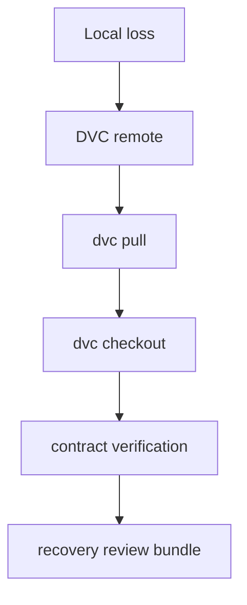
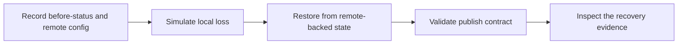

# Recovery Guide

<!-- page-maps:start -->
## Guide Maps

<!-- page-maps:end -->

This guide exists because recovery is easy to talk about loosely and hard to evaluate honestly.

## What the recovery drill proves

- tracked state can be restored after local cache loss
- the promoted publish bundle can be validated after restore
- the remote is part of the repository’s durable story, not an optional convenience

## What the recovery drill does not prove

- that the publish bundle is the full internal state story
- that experiments remain semantically comparable
- that every local convenience file is reproducible or durable

Read [STATE_LAYER_GUIDE.md](STATE_LAYER_GUIDE.md) when the main confusion is not the
recovery sequence itself but which layer is authoritative before and after recovery.

## Best route

1. Run `make recovery-drill` when you want the raw restore rehearsal.
2. Run `make recovery-review` when you want a durable bundle for later inspection.
3. Read `before-status.txt`, `pull.txt`, `checkout.txt`, `verify.json`, and `publish-v1/manifest.json` in that order.
