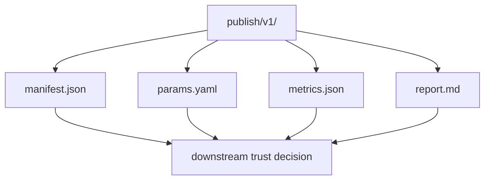
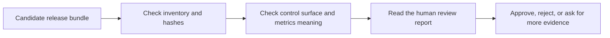

# Release Review Guide

<!-- page-maps:start -->
## Guide Maps

<!-- page-maps:end -->

Use this guide when the question is no longer "did the pipeline run?" and is now
"what exactly can a downstream reviewer trust?"

## Release review order

1. `manifest.json` for inventory and integrity
2. `data-profile.json` for the promoted population story
3. `params.yaml` for the promoted control surface
4. `model.json` for the promoted scoring behavior
5. `metrics.json` for the promoted quantitative story
6. `report.md` for the human-readable summary
7. `predictions.csv` for deeper inspection

## What this route proves

- the promoted boundary is explicit and auditable
- the downstream control surface is small and reviewable
- the release bundle can be defended without forcing a reviewer through the entire repository

Read [PREDICTION_REVIEW_GUIDE.md](PREDICTION_REVIEW_GUIDE.md) when the release question
depends on concrete false negatives, false positives, or borderline promoted rows.

## What this route does not prove

- that every internal experiment has been reviewed
- that the local cache is durable
- that the publish bundle replaces `dvc.lock` for internal provenance questions

Read [CONTROL_SURFACE_GUIDE.md](CONTROL_SURFACE_GUIDE.md) when a release question is
really a comparability question about params, thresholding, or metric movement.
