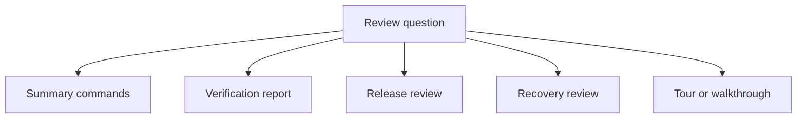
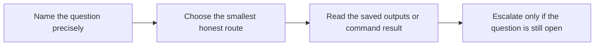

# Review Route Guide

<!-- page-maps:start -->
## Guide Maps

<!-- page-maps:end -->

Use this guide when the capstone now has enough commands and bundles that route choice
could become its own source of noise. The goal is not to memorize targets. The goal is
to match each review question to the smallest honest evidence surface.

## Fast route selection

| If the question is about... | Start with |
| --- | --- |
| stage ownership and declared versus recorded edges | `make stage-summary` |
| promoted population facts | `make profile-summary` |
| promoted scoring behavior | `make model-summary` |
| promoted inventory and training metadata | `make manifest-summary` |
| borderline decisions near the threshold | `make threshold-review` |
| concrete misclassifications | `make review-queue` and `publish/v1/predictions.csv` |
| whether the promoted contract currently passes | `make verify` |
| saved contract evidence plus enforcement logic | `make verify-report` |
| downstream trust in the promoted release boundary | `make release-review` |
| remote-backed restoration after local loss | `make recovery-review` |
| first-read orientation through the repository | `make walkthrough` |
| broader executed proof across repository state | `make tour` |
| strongest built-in local bar | `make confirm` |

## Escalation order

1. Start with one summary command when the question is narrow.
2. Use `make verify` when the question becomes contract validity.
3. Use `make verify-report`, `make release-review`, or `make recovery-review` when the answer must survive later inspection.
4. Use `make confirm` only when the whole repository story is under pressure.

## What this guide prevents

- defaulting to `confirm` when a smaller route would answer the question more cleanly
- using release review when the question is still only about stage truth
- using one promoted metric as a substitute for profile, model, or record-level review
- treating recovery review as if it replaced ordinary release review
