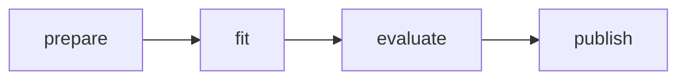
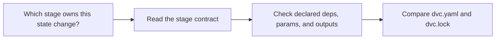

# Stage Contract Guide

<!-- page-maps:start -->
## Guide Maps

<!-- page-maps:end -->

Use this guide when `dvc.yaml` feels mechanically readable but the stage boundaries still
feel implicit. The goal is to make each stage promise explicit enough that a learner can
name what belongs to that edge and what does not.

## Stage promises

| Stage | What it owns | What it should not own |
| --- | --- | --- |
| `prepare` | row normalization, deterministic split, and dataset profile | model training, evaluation metrics, or publish decisions |
| `fit` | reference model training from the prepared train split | data splitting, evaluation thresholding, or publish packaging |
| `evaluate` | prediction generation and metric calculation on the eval split | training updates or release-boundary packaging |
| `publish` | downstream review bundle construction and manifest writing | hidden retraining or recomputing evaluation facts |

## Best file route by stage

1. `dvc.yaml` to see the declared contract
2. `dvc.lock` to see the recorded execution state
3. one owning implementation file:
   - `prepare.py`
   - `fit.py`
   - `evaluate.py`
   - `publish.py`

Use `make stage-summary` when you want the repository to render that declared-versus-recorded comparison before you read the raw YAML yourself.

## Best review questions

- Which params are declared at this stage instead of borrowed implicitly?
- Which outputs become trustworthy enough for the next stage?
- Which facts should be reviewed in `dvc.lock` after execution?
- Which promoted facts should still wait until `publish/v1/`?

## Best companion guides

- read [ARCHITECTURE.md](ARCHITECTURE.md) when the next question is file ownership above the stage level
- read [STATE_LAYER_GUIDE.md](STATE_LAYER_GUIDE.md) when the next question is which state is authoritative before or after a stage runs
- read [PUBLISH_CONTRACT.md](PUBLISH_CONTRACT.md) when the question moves from stage truth to downstream trust
