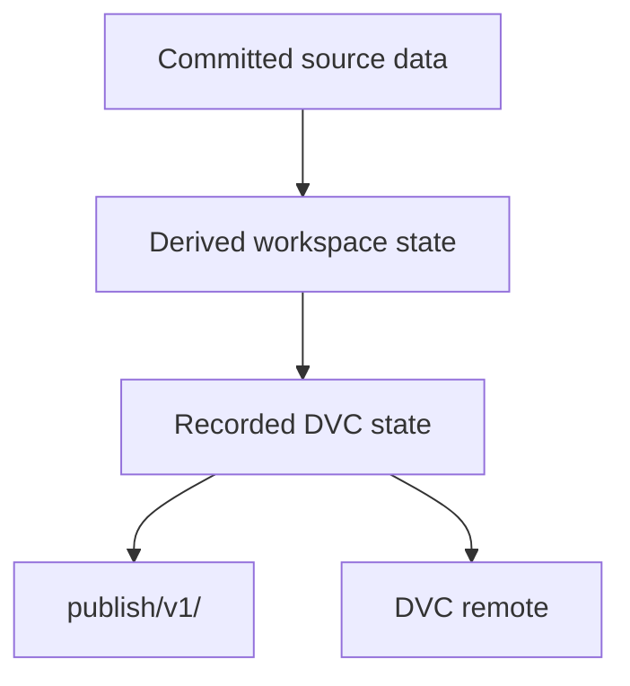
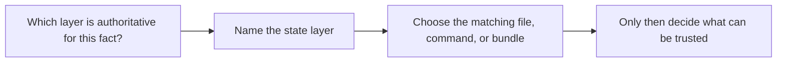

# State Layer Guide

<!-- page-maps:start -->
## Guide Maps

<!-- page-maps:end -->

Use this guide when the capstone's files are individually understandable but their
authority relationship is still fuzzy. The goal is to separate repository state,
recorded execution state, promoted review state, and remote-backed recovery state.

## State layers

| Layer | Main surface | What it is authoritative for |
| --- | --- | --- |
| source data | `data/raw/service_incidents.csv` | the committed raw incident records |
| declared workflow | `dvc.yaml` and `params.yaml` | the intended stage graph and declared control surface |
| recorded execution | `dvc.lock` | what was actually executed and recorded by DVC |
| derived workspace state | `data/derived/`, `metrics/`, `models/`, `state/` | local outputs produced by the last run |
| promoted release state | `publish/v1/` | the stable downstream review contract |
| recovery durability | DVC remote plus recovery bundle evidence | whether tracked outputs can be restored after local loss |

## Fast authority rules

- use `dvc.yaml` to ask what should happen
- use `dvc.lock` to ask what did happen
- use `publish/v1/` to ask what a downstream reviewer may trust
- use the recovery route to ask what survives local loss
- do not use the working tree alone to answer promotion or durability questions

## Best companion guides

- read [RECOVERY_GUIDE.md](RECOVERY_GUIDE.md) when the next question is remote-backed durability
- read [PUBLISH_CONTRACT.md](PUBLISH_CONTRACT.md) when the next question is downstream trust
- read [STAGE_CONTRACT_GUIDE.md](STAGE_CONTRACT_GUIDE.md) when the next question is which stage should own a change in state
