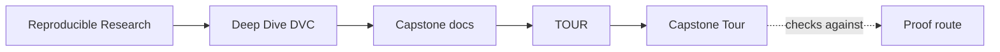
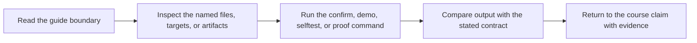

# Capstone Tour


<!-- page-maps:start -->
## Guide Maps




<!-- page-maps:end -->

This tour is the executed proof route for the DVC capstone. It builds a bundle that
captures the repository state the course asks you to reason about: declared pipeline
shape, recorded execution state, tracked metrics, promoted artifacts, and the stable
publish boundary.

If you want a lighter first step, run `make walkthrough` first. That bundle contains the
repository contract, pipeline declaration, recorded lock state, params surface, and a
suggested reading route without executing the workflow.

## What the tour produces

- `status.txt`: DVC's current view of whether the repository is up to date
- `pipeline.dot`: the declared stage graph in Graphviz DOT format
- `dvc.yaml`: the declared pipeline contract
- `dvc.lock`: the recorded state transition after execution
- `params.yaml`: the declared control surface for the run
- `metrics.json`: the tracked evaluation result
- `publish-v1/`: the promoted artifact bundle that downstream consumers should trust

## How to run it

From the capstone directory:

```bash
make walkthrough
make tour
```

From the repository root:

```bash
make PROGRAM=reproducible-research/deep-dive-dvc capstone-walkthrough
make PROGRAM=reproducible-research/deep-dive-dvc capstone-tour
make PROGRAM=reproducible-research/deep-dive-dvc capstone-confirm
```

## What to inspect first

1. `README.md`
2. `dvc.yaml`
3. `dvc.lock`
4. `params.yaml`
5. `metrics.json`
6. `publish-v1/manifest.json`
7. `publish-v1/report.md`

That order mirrors the course: repository contract, declared graph, recorded execution,
declared inputs, measured outcome, promoted interface, and human-readable report.

## What this tour does not replace

The tour is corroboration, not first-contact teaching. If state identity, promotion, or
recovery still feels abstract, return to the course module first and then come back.
