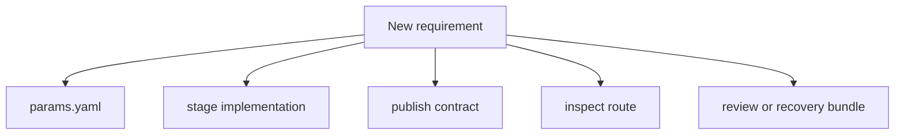
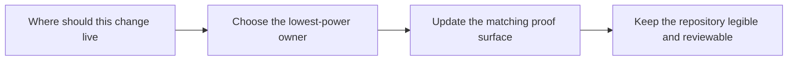

# Change Placement Guide

<!-- page-maps:start -->
## Guide Maps

<!-- page-maps:end -->

Use this guide when a new requirement seems valid but it is not yet obvious where it
belongs. The main job is to keep ownership obvious a year later: control in control
surfaces, stage logic in stages, promoted meaning in the publish contract, and saved
review evidence only where later inspection genuinely needs it.

## Preferred owners

| If the change is about... | Prefer this owner | First proof surface |
| --- | --- | --- |
| split, training, or decision policy | `params.yaml` | `dvc.yaml`, `dvc.lock`, and `CONTROL_SURFACE_GUIDE.md` |
| data normalization or stage computation | `prepare.py`, `fit.py`, `evaluate.py`, or `publish.py` | matching unit test plus `make stage-summary` or `make verify` |
| downstream trust and promoted meaning | `PUBLISH_CONTRACT.md` and `publish.py` | `make release-review` and `make verify` |
| learner-facing summaries | `inspect.py` | `tests/test_inspect.py` and the matching Make target |
| saved audit evidence | review-bundle targets and `scripts/write_bundle_manifest.py` | saved bundle manifests plus bundle route files |
| durability and restore guarantees | recovery targets and `RECOVERY_GUIDE.md` | `make recovery-drill` or `make recovery-review` |

## Placement rules

1. change `params.yaml` before adding hidden constants to Python code
2. change one stage implementation before broadening the publish contract
3. change the publish contract only when a downstream reviewer truly needs the new fact
4. add or widen an inspect route only when a real review question is still hard to answer
5. add bundle content only when it improves later review, not just because it exists locally

## What this guide prevents

- hiding control-surface changes in code
- using the publish bundle as a substitute for the full repository story
- adding broad review bundles when one narrower route would stay clearer
- teaching DVC as a pile of commands instead of a system of ownership decisions
