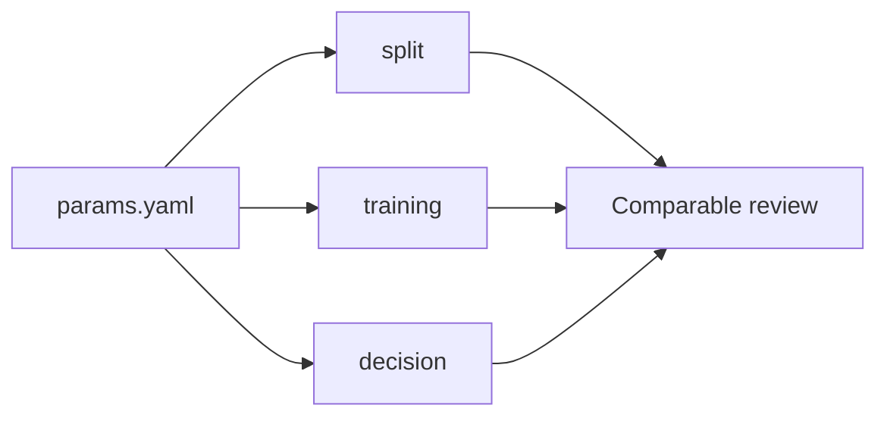
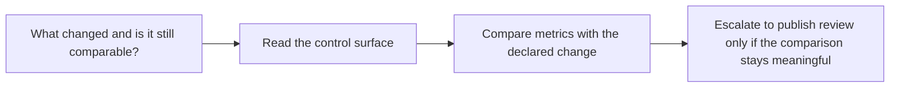

# Control Surface Guide

<!-- page-maps:start -->
## Guide Maps

<!-- page-maps:end -->

Use this guide when `params.yaml` and `metrics.json` are visible but their review meaning
is still too implicit. The goal is to make the capstone's declared control surface and
its comparable outcomes explicit.

## Declared control surface

| Section | Meaning | Why it matters |
| --- | --- | --- |
| `split` | deterministic train/eval partition rules | keeps evaluation rows comparable over time |
| `training` | optimization behavior for the reference model | explains why the learned scoring function changed |
| `decision` | threshold for converting probabilities into escalated predictions | explains why promoted predictions and confusion totals changed |

## Review rules

- compare metrics only after naming the parameter change that produced them
- treat threshold changes as decision-policy changes, not model-quality changes alone
- treat split changes as population changes that can weaken baseline comparability
- treat training changes as model-behavior changes that still need release-boundary evidence before promotion

Use `make threshold-review` when the decision threshold is the main pressure and you want
to inspect borderline promoted predictions instead of only aggregate metrics.

## Best companion guides

- read [EXPERIMENT_GUIDE.md](../EXPERIMENT_GUIDE.md) when the next question is how to run and compare a changed candidate
- read [RELEASE_REVIEW_GUIDE.md](../RELEASE_REVIEW_GUIDE.md) when the next question is whether a changed candidate deserves downstream trust
- read [PUBLISH_CONTRACT.md](../PUBLISH_CONTRACT.md) when the next question is which control surfaces are preserved in `publish/v1/`
