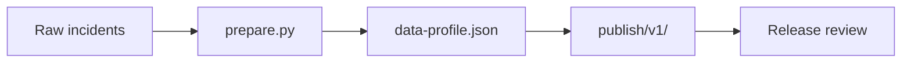
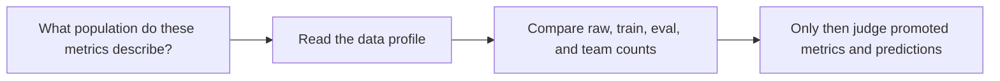

# Data Profile Guide

<!-- page-maps:start -->
## Guide Maps

<!-- page-maps:end -->

Use this guide when the promoted metrics feel precise but the population behind them is
still blurry. The goal is to make `data-profile.json` the first place you check what was
split, counted, and summarized before trusting evaluation results.

## What the data profile owns

| Field | Meaning | Why it matters |
| --- | --- | --- |
| `raw_rows` | total committed incident rows | defines the starting repository population |
| `train_rows` | rows assigned to training | explains the model-fitting population |
| `eval_rows` | rows assigned to evaluation | explains the metrics and predictions population |
| `escalated_rows` | total positive outcomes | gives the outcome prevalence context |
| `escalation_rate` | positive-rate summary across raw rows | helps interpret accuracy and threshold choices |
| `feature_names` | declared feature contract | keeps the review tied to the intended model inputs |
| `teams` | row counts by owning team | keeps review anchored in operational ownership, not only totals |

## What the data profile should not answer

- whether the model is good enough for promotion
- whether the threshold is appropriate for release
- whether the publish bundle alone proves internal provenance

Use `make profile-summary` when you want the promoted population story rendered into one
reviewable summary before opening the raw JSON.

## Best companion guides

- read [PUBLISH_CONTRACT.md](../PUBLISH_CONTRACT.md) when the next question is why the profile belongs in `publish/v1/`
- read [RELEASE_REVIEW_GUIDE.md](../RELEASE_REVIEW_GUIDE.md) when the next question is how to combine profile, metrics, and report review
- read [CONTROL_SURFACE_GUIDE.md](../CONTROL_SURFACE_GUIDE.md) when the next question is whether params changes still keep the profile and metrics comparable
