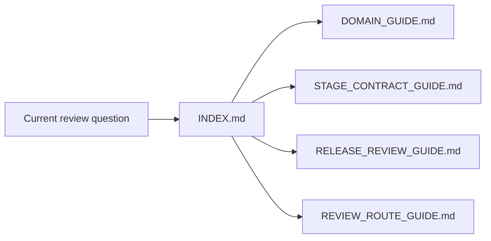
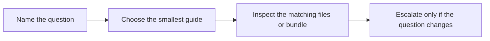

# Capstone Index

<!-- page-maps:start -->
## Guide Maps

<!-- page-maps:end -->

Use this page as the stable entry route for the DVC capstone docs. It keeps the local
surface small enough that a learner can choose a guide deliberately instead of browsing.

## Start here by question

| If the question is... | Start here | Escalate only if needed |
| --- | --- | --- |
| what repository story is being modeled | `DOMAIN_GUIDE.md` | `ARCHITECTURE.md` and `make walkthrough` |
| which stage or state layer owns a change | `STAGE_CONTRACT_GUIDE.md` | `ARCHITECTURE.md` and `make stage-summary` |
| what a downstream reviewer may trust | `PUBLISH_CONTRACT.md` | `RELEASE_REVIEW_GUIDE.md` and `make release-review` |
| how to compare a changed candidate honestly | `EXPERIMENT_GUIDE.md` | `make experiment-review` and `RELEASE_REVIEW_GUIDE.md` |
| how restore and remote durability are reviewed | `RECOVERY_GUIDE.md` | `make recovery-review` |
| which saved route answers the current question fastest | `REVIEW_ROUTE_GUIDE.md` | `TOUR.md` and `make tour` |

## Stable local doc surface

- `ARCHITECTURE.md`
- `DOMAIN_GUIDE.md`
- `EXPERIMENT_GUIDE.md`
- `INDEX.md`
- `PUBLISH_CONTRACT.md`
- `RECOVERY_GUIDE.md`
- `RELEASE_REVIEW_GUIDE.md`
- `REVIEW_ROUTE_GUIDE.md`
- `STAGE_CONTRACT_GUIDE.md`
- `TOUR.md`
