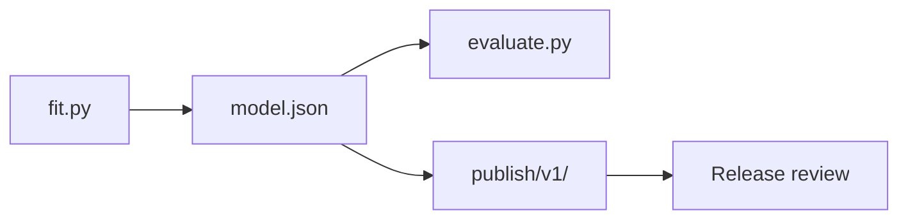
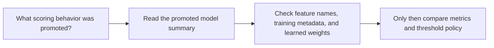

# Model Guide

<!-- page-maps:start -->
## Guide Maps

<!-- page-maps:end -->

Use this guide when `model.json` feels like a technical artifact rather than a review
surface. The goal is to make the promoted model file legible enough to support release
review without pretending it tells the whole repository story by itself.

## What the promoted model owns

| Section | Meaning | Why it matters |
| --- | --- | --- |
| `feature_names` | declared model input contract | proves the promoted scorer still matches the capstone feature set |
| `weights` | learned influence per standardized feature | exposes the promoted scoring behavior |
| `means` and `scales` | standardization contract from training data | explains how raw values become model inputs |
| `bias` | base decision tendency | keeps the scoring rule reproducible rather than implied |
| `training` | rows, iterations, learning rate, l2, and final loss | keeps the promoted training story reviewable later |

## What the promoted model should not answer

- whether the threshold is the right operational decision policy
- whether one experiment should replace the baseline
- whether the publish bundle proves full internal provenance

Use `make model-summary` when you want the promoted training and weight story rendered
into one compact review surface before opening the raw model file.

## Best companion guides

- read [CONTROL_SURFACE_GUIDE.md](../CONTROL_SURFACE_GUIDE.md) when the next question is how training params changed the model behavior
- read [PUBLISH_CONTRACT.md](../PUBLISH_CONTRACT.md) when the next question is why the model belongs in the promoted release boundary at all
- read [RELEASE_REVIEW_GUIDE.md](../RELEASE_REVIEW_GUIDE.md) when the next question is how to combine model review with metrics and report review
