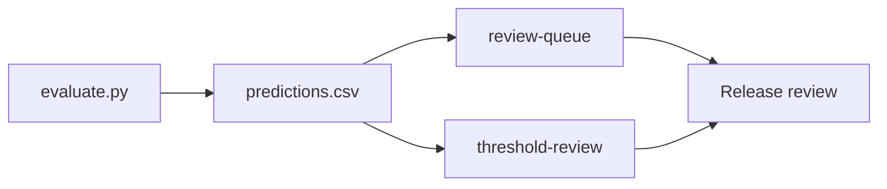
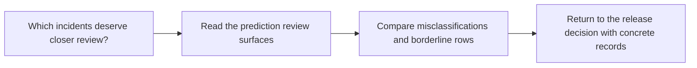

# Prediction Review Guide

<!-- page-maps:start -->
## Guide Maps

<!-- page-maps:end -->

Use this guide when aggregate metrics look acceptable but you still need to know which
records deserve human attention. The goal is to make `predictions.csv`, `review-queue`,
and `threshold-review` work together as one honest review surface.

## Review layers

| Surface | Best question |
| --- | --- |
| `predictions.csv` | what happened on each promoted eval row |
| `make review-queue` | which false positives and false negatives most need immediate inspection |
| `make threshold-review` | which promoted predictions are closest to the current decision line |
| `report.md` | which rows are worth mentioning in the human release summary |

## Review rules

- use `review-queue` when you need known mistakes first
- use `threshold-review` when the decision line itself is under pressure
- return to raw `predictions.csv` when one team or incident pattern needs closer inspection
- do not treat aggregate metrics as a substitute for record-level review when the release question is operational

## Best companion guides

- read [CONTROL_SURFACE_GUIDE.md](../CONTROL_SURFACE_GUIDE.md) when the next question is whether threshold changes are still comparable
- read [RELEASE_REVIEW_GUIDE.md](../RELEASE_REVIEW_GUIDE.md) when the next question is whether record-level evidence changes downstream trust
- read [MODEL_GUIDE.md](../MODEL_GUIDE.md) when the next question is whether a record pattern points back to the promoted scoring behavior
