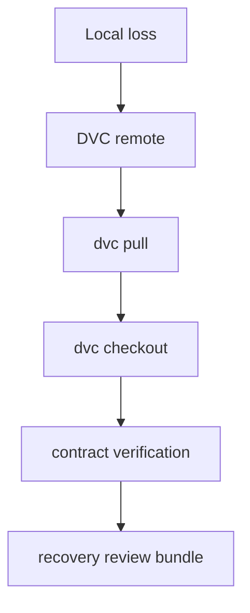

# Recovery Guide

<!-- page-maps:start -->
## Guide Maps

<!-- page-maps:end -->

Recovery is easy to talk about loosely and hard to evaluate honestly. Use this guide when
the question is not just whether `dvc pull` works, but what a successful restore actually
proves.

## What the recovery drill proves

- tracked state can be restored after local cache loss
- the promoted publish bundle can be validated after restore
- the remote is part of the repository's durable story, not an optional convenience

## What the recovery drill does not prove

- that the publish bundle is the full internal state story
- that experiments remain semantically comparable
- that every local convenience file is reproducible or durable

## Good route

1. run `make recovery-drill` when you want the raw restore rehearsal
2. run `make recovery-review` when you want a durable bundle for later inspection
3. read `remote.txt`, `before-status.txt`, `pull.txt`, `checkout.txt`, `verify.json`, and `after-status.txt` in that order
4. read `publish-v1/manifest.json` and the release summaries when the next question is downstream trust after restore

Read [Publish Contract](PUBLISH_CONTRACT.md) when the main confusion is not the recovery
sequence itself but which promoted files still deserve downstream trust after restore.
