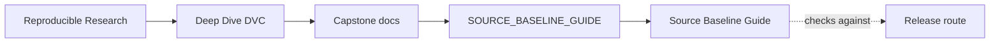
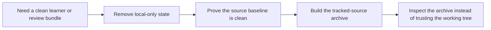

# Source Baseline Guide


<!-- page-maps:start -->
## Guide Maps




<!-- page-maps:end -->

Use this guide when you need a source artifact that reflects the tracked capstone rather
than whatever local state happens to be lying around in the working tree.

## What this guide is protecting

This capstone deliberately creates local state while you work:

- `data/derived/`, `metrics/`, `models/`, `publish/`, and `state/` are generated outputs
- `.dvc/cache` and `.dvc-remote/` are local storage surfaces, not learner-facing source
- `.pytest_cache/`, `__pycache__/`, and editable-install metadata are runtime residue

Those surfaces are useful while developing and verifying the capstone. They are not part
of the clean source baseline another learner should download and inspect first.

## Source baseline workflow

Run these commands from the capstone directory:

```bash
make source-baseline-clean
make source-baseline-check
make source-bundle
```

The intent of each step is different:

- `make source-baseline-clean` removes local-only state that should never ship
- `make source-baseline-check` proves the tree is free of the known contamination paths
- `make source-bundle` writes a tracked-source archive built from `git ls-files`, so the
  output depends on tracked repository state instead of local junk

## What the source bundle includes

The source bundle includes tracked capstone files such as:

- capstone docs and review guides
- `dvc.yaml`, `dvc.lock`, `params.yaml`, and tracked DVC metadata
- source code under `src/`
- tests and helper scripts
- committed source data and other tracked repository inputs

## What the source bundle excludes

The source bundle excludes:

- generated pipeline outputs
- local caches and remotes
- bytecode, pytest state, and editable-install metadata
- any other untracked or ignored working-tree files

## Best companion pages

- `README.md`
- `RELEASE_REVIEW_GUIDE.md`
- `RECOVERY_GUIDE.md`
- `course-book/capstone/index.md`
