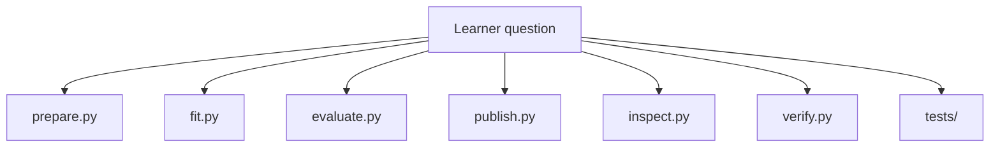
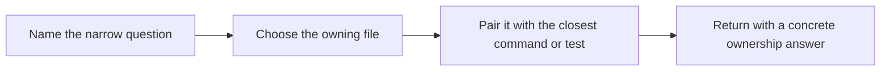

# Source Guide

<!-- page-maps:start -->
## Guide Maps

<!-- page-maps:end -->

Use this guide when the stage and state maps are clear but you still need the exact file
that owns a behavior. The goal is to keep repository review precise instead of broad and
fatiguing.

## Fast file routing

| Question | Open this first | Then pair with |
| --- | --- | --- |
| How are rows normalized and split? | `prepare.py` | `tests/test_prepare.py` |
| How is the reference model fit? | `fit.py` | `tests/test_model.py` |
| How are metrics and predictions computed? | `evaluate.py` | `publish/v1/metrics.json` and `tests/test_inspect.py` |
| How is the publish bundle assembled? | `publish.py` | `PUBLISH_CONTRACT.md` and `tests/test_verify.py` |
| How are learner-facing summaries rendered? | `inspect.py` | `make stage-summary`, `make state-summary`, `make threshold-review`, and `tests/test_inspect.py` |
| How is the promoted contract enforced? | `verify.py` | `make verify` and `tests/test_verify.py` |

## Best companion guides

- read [ARCHITECTURE.md](../ARCHITECTURE.md) when you still need the higher-level ownership map first
- read [STAGE_CONTRACT_GUIDE.md](../STAGE_CONTRACT_GUIDE.md) when the question is stage ownership more than file ownership
- read [TOUR.md](../TOUR.md) when you want the same code route turned into a proof-reading route
