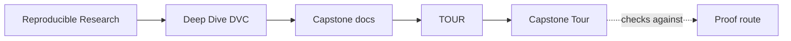
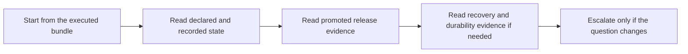

# Capstone Tour

<!-- page-maps:start -->
## Guide Maps

<!-- page-maps:end -->

This tour is the executed proof route for the DVC capstone. It builds a bundle under
`artifacts/tour/reproducible-research/deep-dive-dvc/` so you can inspect declared
pipeline shape, recorded execution state, promoted artifacts, and the saved summaries
that explain how those surfaces fit together.

If you want a lighter first step, run `make walkthrough` first.

## What the tour produces

- `status.txt` for DVC's current up-to-date state
- `remote.txt` for the configured DVC remote list
- `pipeline.dot` for the declared stage graph in Graphviz DOT format
- `dvc.yaml`, `dvc.lock`, and `params.yaml` for declared versus recorded state and control surface
- `metrics.json` for the tracked evaluation result
- `manifest-summary.json`, `profile-summary.json`, `model-summary.json`, `stage-summary.json`, `state-summary.json`, `release-summary.json`, `review-queue.json`, and `threshold-review.json` for compact saved review surfaces
- `publish-v1/` for the promoted downstream contract
- `PUBLISH_CONTRACT.md`, `ARCHITECTURE.md`, `EXPERIMENT_GUIDE.md`, `RECOVERY_GUIDE.md`, and `RELEASE_REVIEW_GUIDE.md` for the matching interpretation guides

## Good first reading order

1. `status.txt`
2. `stage-summary.json`
3. `dvc.yaml` and `dvc.lock`
4. `params.yaml`
5. `manifest-summary.json` and `publish-v1/manifest.json`
6. `profile-summary.json`, `model-summary.json`, `threshold-review.json`, and `publish-v1/metrics.json`
7. `release-summary.json`, `publish-v1/report.md`, and `review-queue.json`
8. `remote.txt` and `RECOVERY_GUIDE.md` when the question turns to durability after loss

That order keeps declaration and recorded state ahead of promotion, and promotion ahead
of recovery.

## When to step out of the tour

- use `REVIEW_ROUTE_GUIDE.md` when the question might be narrower than the tour
- use `PUBLISH_CONTRACT.md` when the question is specifically downstream trust
- use `RECOVERY_GUIDE.md` when the question is specifically restore and remote durability
- use `INDEX.md` when you know the question but not the next guide
