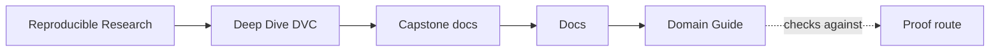
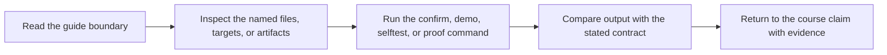

# Domain Guide

<!-- page-maps:start -->
## Guide Maps

<!-- page-maps:end -->

Use this guide when the capstone feels structurally clear but the modeled problem still
feels abstract. The goal is to make the incident-escalation story concrete before you
reason about DVC state and review routes.

## What the raw dataset represents

The repository models service incidents that may or may not escalate into a broader
operational response. Each row describes one incident with a small feature set that a
team could plausibly review before deciding whether closer intervention is likely.

## Column meanings

| Column | Meaning | Why it matters |
| --- | --- | --- |
| `incident_id` | stable incident identifier | keeps split logic and review examples tied to a real record |
| `team` | owning service or platform team | lets prediction review stay anchored in operational ownership |
| `backlog_days` | age of the incident in days | captures unresolved operational pressure |
| `reopened_count` | number of reopen events | captures churn and instability |
| `integration_touchpoints` | number of connected systems involved | captures coordination breadth |
| `customer_tier` | customer criticality bucket | captures business impact pressure |
| `weekend_handoff` | whether the incident crossed a weekend handoff | captures time-and-coordination friction |
| `severity_score` | numeric severity proxy | captures direct operational urgency |
| `escalated` | whether the incident escalated | is the target outcome the model predicts |

## What the publish bundle is trying to help a reviewer answer

- what population the model saw and evaluated
- what threshold was used for the promoted decision policy
- which eval rows were predicted correctly or incorrectly
- whether the promoted metrics describe a problem a human can still reason about later

## Best companion guides

- read [Capstone Architecture](architecture.md) when the domain is clear but the repository ownership layers are not
- read [Experiment Guide](experiment-guide.md) when the next question is how declared controls change the review meaning
- read [Publish Contract](publish-contract.md) when the next question is which domain evidence survives into `publish/v1/`
