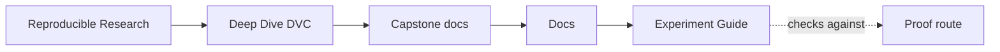
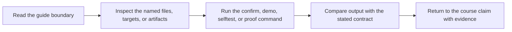

# Experiment Guide

<!-- page-maps:start -->
## Guide Maps

<!-- page-maps:end -->

This guide exists because experiment support is one of the easiest parts of DVC to use sloppily.

## What an experiment is for here

In this capstone, an experiment is a controlled deviation from the baseline parameter
surface. It is not a license to mutate the baseline story until the result looks good.

## Review questions

- Which parameter changed, and why does that change stay comparable to the baseline?
- Which metrics moved, and what do those changes mean operationally?
- Which prediction records changed enough to justify closer review?
- What evidence would be required before promotion to `publish/v1/`?

## Minimum route

1. Inspect baseline `params.yaml` and `metrics/metrics.json`.
2. Run `dvc exp run` with one declared change.
3. Use `dvc exp show` to compare the candidate against the baseline.
4. Return to the publish contract only if the candidate is worth promotion.

Read [STAGE_CONTRACT_GUIDE.md](stage-contract-guide.md) first when the real pressure is
not how to run the experiment, but whether the changed params still support honest
comparison and still belong to the stage that owns them.
