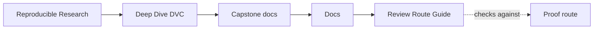
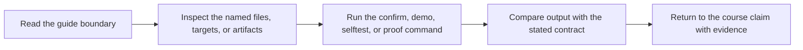

# Review Route Guide

<!-- page-maps:start -->
## Guide Maps

<!-- page-maps:end -->

Use this guide when route choice itself is becoming noise. The goal is not to memorize
targets. The goal is to match each state or release question to the smallest honest
evidence surface.

## Choose by question

| If the question is about... | Start here | Escalate if needed |
| --- | --- | --- |
| declared versus recorded stage truth | `make stage-summary` | `make verify` |
| promoted population facts | `make profile-summary` | `make verify-report` |
| promoted scoring behavior | `make model-summary` | `make release-review` |
| promoted inventory and release metadata | `make manifest-summary` | `make release-review` |
| borderline decisions near the threshold | `make threshold-review` | `make release-review` |
| concrete misclassifications | `make review-queue` and `publish/v1/predictions.csv` | `make release-review` |
| whether the promoted contract currently passes | `make verify` | `make verify-report` |
| saved contract evidence plus enforcement logic | `make verify-report` | `make confirm` |
| downstream trust in the promoted release boundary | `make release-review` | `make confirm` |
| remote-backed restoration after local loss | `make recovery-review` | `make confirm` |
| first-read orientation through the repository | `make walkthrough` | `make tour` |
| broader executed proof across repository state | `make tour` | `make confirm` |

## Escalation rules

1. start with one summary command when the question is narrow
2. use `make verify` when the question becomes contract validity
3. use `make verify-report`, `make release-review`, or `make recovery-review` when the answer must survive later inspection
4. use `make confirm` only when the whole repository story is under pressure

## What this guide prevents

- defaulting to `confirm` when a smaller route would answer the question more cleanly
- using release review when the question is still only about stage truth
- using one promoted metric as a substitute for profile, model, or record-level review
- treating recovery review as if it replaced ordinary release review
