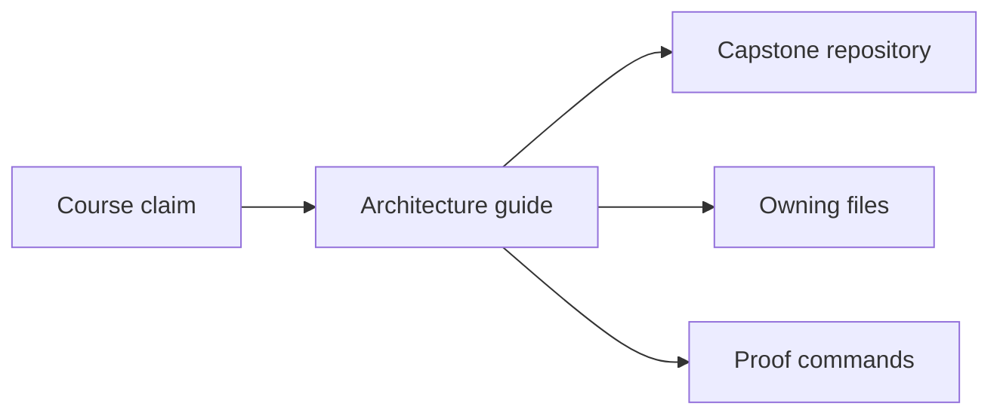
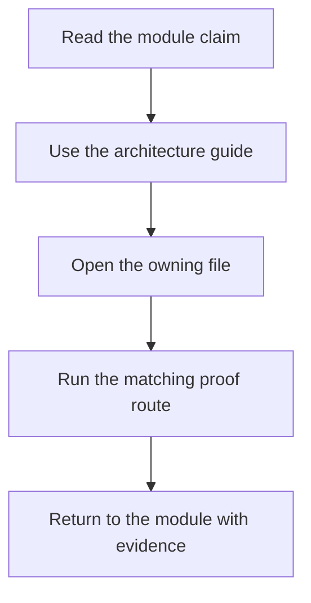

# Capstone Architecture Guide

<!-- page-maps:start -->
## Page Maps

<!-- page-maps:end -->

Use this guide when the DVC capstone feels understandable at the repository level but not
yet at the ownership level.

## Architectural route

- declaration lives in `dvc.yaml`, `params.yaml`, and the repository README
- execution logic lives in `src/incident_escalation_capstone/`
- promotion logic lives in `publish.py` and `publish/v1/`
- contract enforcement lives in `verify.py`
- review packaging lives in the capstone Makefile targets and generated bundles

## Best reading order

1. Read `capstone/README.md`.
2. Read `capstone/ARCHITECTURE.md`.
3. Read `capstone/dvc.yaml` and `capstone/dvc.lock`.
4. Read one implementation file from `src/incident_escalation_capstone/`.
5. Run the proof command that matches the question you are asking.

## Best companion pages

- [Repository Layer Guide](repository-layer-guide.md)
- [Capstone File Guide](capstone-file-guide.md)
- [Capstone Map](capstone-map.md)
- [Verification Route Guide](verification-route-guide.md)
