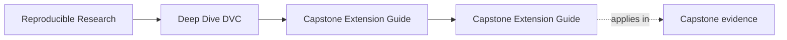
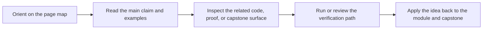

# Capstone Extension Guide

<!-- page-maps:start -->
## Page Maps

<!-- page-maps:end -->

Use this guide when changing the DVC capstone after the course is already in use.

The goal is not to forbid growth. The goal is to keep new work from weakening the state,
promotion, and recovery contracts the course depends on.

---

## Boundaries That Must Stay Legible

These boundaries should remain explicit:

* source data versus derived state
* declared pipeline contract versus recorded execution state
* internal repository state versus `publish/v1/`
* local cache convenience versus remote-backed durability

[Back to top](#top)

---

## Safe Kinds Of Change

These changes are usually safe when reviewed carefully:

* adding a new internal stage whose dependencies and outputs are fully declared
* enriching the publish bundle without breaking existing promoted files
* extending params or metrics when comparability rules are updated with them
* strengthening verification or recovery evidence

[Back to top](#top)

---

## Risky Kinds Of Change

These changes need stronger review:

* changing the meaning of an existing promoted artifact
* adding parameters that silently invalidate historical comparisons
* moving recovery guarantees from the remote to local cache assumptions
* changing stage behavior without making the new dependency surface legible in `dvc.yaml`

[Back to top](#top)

---

## Minimum Proof After A Change

After any meaningful capstone change, rerun:

1. `make -C capstone walkthrough`
2. `make -C capstone verify`
3. `make -C capstone recovery-drill`
4. `make -C capstone tour`

If any of those results become harder to explain, the repository likely got worse even if
it still runs.

[Back to top](#top)

---

## Best Companion Pages

Use these pages with this guide:

* [`capstone-file-guide.md`](capstone-file-guide.md)
* [`capstone-review-worksheet.md`](capstone-review-worksheet.md)
* [`proof-matrix.md`](proof-matrix.md)
* [`completion-rubric.md`](completion-rubric.md)

[Back to top](#top)
