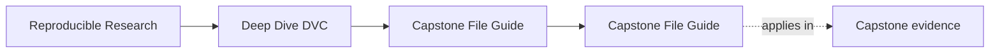
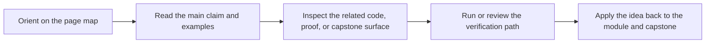

# Capstone File Guide

<!-- page-maps:start -->
## Page Maps

<!-- page-maps:end -->

This page explains which capstone files matter first and what responsibility each one
holds.

Use it when the repository feels understandable at a directory level but not yet at a
file level.

---

## Start With These Files

| File | Why it matters |
| --- | --- |
| `capstone/README.md` | defines the repository contract and the proof questions it is trying to answer |
| `capstone/ARCHITECTURE.md` | explains which files own declaration, execution, promotion, and verification |
| `capstone/dvc.yaml` | declares the pipeline graph and stage boundaries |
| `capstone/dvc.lock` | records executed state and declared evidence |
| `capstone/params.yaml` | defines the parameter surface that controls comparable runs |
| `capstone/Makefile` | exposes the learner-facing verification and recovery targets |
| `capstone/EXPERIMENT_GUIDE.md` | explains how to inspect comparable experiment changes without mutating the baseline story |
| `capstone/RECOVERY_GUIDE.md` | explains what the restore drill proves and what it does not prove |
| `capstone/RELEASE_REVIEW_GUIDE.md` | explains how to review the promoted boundary as a downstream contract |
| `capstone/TOUR.md` | explains the proof bundle generated for learners and reviewers |
| `capstone/publish/v1/manifest.json` | demonstrates the promoted release evidence boundary |

[Back to top](#top)

---

## Directory Responsibilities

| Path | Responsibility |
| --- | --- |
| `capstone/data/raw/` | committed source data used to begin the state story |
| `capstone/data/derived/` | generated intermediate data produced by the pipeline |
| `capstone/src/incident_escalation_capstone/` | implementation of preparation, fitting, evaluation, publication, and verification logic |
| `capstone/metrics/` | tracked evaluation outputs |
| `capstone/models/` | model artifacts produced by the pipeline |
| `capstone/publish/v1/` | promoted downstream contract and evidence bundle |
| `capstone/state/` | non-promoted but reviewable intermediate state surfaces |
| `capstone/tests/` | executable checks for code-level behavior |

[Back to top](#top)

---

## Best Reading Order

1. `capstone/README.md`
2. `capstone/dvc.yaml`
3. `capstone/dvc.lock`
4. `capstone/params.yaml`
5. `capstone/Makefile`
6. `capstone/EXPERIMENT_GUIDE.md`, `capstone/RECOVERY_GUIDE.md`, and `capstone/RELEASE_REVIEW_GUIDE.md`
7. `capstone/TOUR.md`
8. `capstone/publish/v1/manifest.json`

That order keeps the learner anchored in contract, then declared graph, then recorded
state, then verification and promotion.

[Back to top](#top)

---

## Common Wrong Reading Order

Avoid starting with:

* implementation files before reading the repository contract
* promoted artifacts before understanding the baseline state story
* `dvc.lock` before reading `dvc.yaml`

That route teaches fragments without context.

[Back to top](#top)
