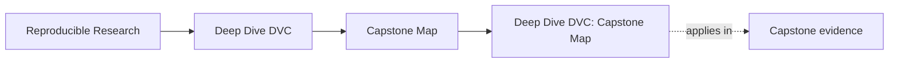
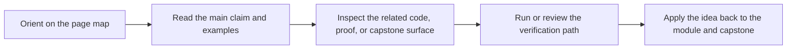

# Deep Dive DVC: Capstone Map

<!-- page-maps:start -->
## Page Maps

<!-- page-maps:end -->

The capstone is the executable cross-check for this program, but it should not be the
first teaching surface for every concept. This page gives you one clear route through
the repository so you know when to enter it, what to inspect, and which command proves
the idea you are studying.

---

## Recommended Entry Rule

Use the capstone lightly in Modules 01-03, heavily in Modules 04-09, and as a review
specimen in Module 10.

If a concept still feels abstract, return to the smaller module exercise first. The
capstone should confirm understanding, not replace first-contact learning.

---

## Module-to-Capstone Route

| Module | Learner goal | Capstone surfaces | Proof command |
| --- | --- | --- | --- |
| 01 Why Reproducibility Fails | see why rerunnable scripts are weaker than explicit state contracts | `README.md`, `TOUR.md`, `data/raw/service_incidents.csv` | `make -C capstone walkthrough` |
| 02 Data Identity | separate location from durable data identity | `data/raw/`, `.dvc/cache`, `.dvc-remote/`, `dvc.lock` | `make -C capstone verify` |
| 03 Environments as Inputs | inspect the runtime boundary instead of treating it as luck | `Makefile`, `pyproject.toml`, `src/incident_escalation_capstone/` | `make -C capstone test` |
| 04 Truthful DAGs | inspect declared stage edges and recorded execution state | `dvc.yaml`, `dvc.lock`, `state/data_profile.json` | `make -C capstone repro` |
| 05 Metrics and Parameters | inspect declared controls and semantic comparison surfaces | `params.yaml`, `metrics/metrics.json`, `publish/v1/metrics.json` | `make -C capstone verify` |
| 06 Experiments | vary the control surface without mutating the baseline contract | `params.yaml`, `metrics/`, `publish/v1/`, experiment comparison bundle | `make -C capstone experiment-review` |
| 07 Collaboration and CI | inspect verification gates and reproducibility checks another person can run | `Makefile`, `tests/`, `TOUR.md` | `make -C capstone confirm` |
| 08 Incident Survival | rehearse cache loss and remote-backed restoration | `.dvc-remote/`, `publish/v1/`, recovery targets, recovery review bundle | `make -C capstone recovery-review` |
| 09 Promotion and Auditability | inspect the promoted interface and the evidence that defends it | `publish/v1/`, `publish/v1/manifest.json`, `publish/v1/params.yaml`, `dvc.lock`, release review bundle | `make -C capstone release-review` |
| 10 Mastery | review the full repository as a long-lived stewardship specimen | `README.md`, `dvc.yaml`, `dvc.lock`, `Makefile`, `publish/v1/` | `make -C capstone confirm` |

[Back to top](#top)

---

## First Capstone Tour

If you want one sane first walkthrough, use this order:

1. Run `make -C capstone walkthrough` to generate the learner-first reading bundle.
2. Read `capstone/README.md` to understand the contract the repository is trying to keep.
3. Read `capstone/dvc.yaml` and then `capstone/dvc.lock` to compare declared versus recorded state.
4. Read `capstone/params.yaml` and `capstone/metrics/metrics.json` to see what comparisons are allowed to mean.
5. Read `capstone/publish/v1/` and `capstone/TOUR.md` to inspect the promoted contract and proof bundle.
6. Run `make -C capstone confirm` when you want executable proof instead of a prose tour.

This order keeps state identity and contract meaning ahead of mechanics.

[Back to top](#top)

---

## Fast Routes by Goal

| Goal | Start here | Then inspect |
| --- | --- | --- |
| Why is this repository more than a data sync folder? | `make -C capstone tour` | `README.md`, `dvc.yaml`, `dvc.lock` |
| What exactly is tracked as state? | `make -C capstone verify` | `params.yaml`, `metrics/`, `publish/v1/` |
| How should I compare experiment candidates? | `make -C capstone experiment-review` | `params.yaml`, `metrics.json`, `exp-show.txt` |
| How would I inspect the truthful pipeline? | `make -C capstone repro` | `dvc.yaml`, `dvc.lock`, `state/` |
| Which outputs are safe for downstream trust? | `make -C capstone release-review` | `publish/v1/manifest.json`, `publish/v1/report.md` |
| How does recovery survive local loss? | `make -C capstone recovery-review` | `.dvc-remote/`, `publish/v1/`, `Makefile` |
| What would I review before migration? | `make -C capstone confirm` | `README.md`, `dvc.yaml`, `dvc.lock`, `Makefile` |

[Back to top](#top)

---

## Capstone Discipline

Use the capstone well:

* read the module first, then verify in the capstone
* prefer commands and files over vague summaries
* inspect one contract question at a time
* treat the proof bundle as review evidence, not decoration

If the repository starts to feel larger than the concept you are studying, step back to
the module and return once the smaller exercise has made the idea legible again.

[Back to top](#top)
