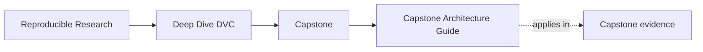

# Capstone Architecture Guide

<!-- page-maps:start -->
## Page Maps

<!-- page-maps:end -->

Use this page when the question is about boundary ownership rather than about a single
command. The DVC capstone stays readable only if declaration, execution, promotion, and
recovery each keep a clear home.

## Boundary map

| Boundary | First files to inspect | What that boundary owns |
| --- | --- | --- |
| pipeline declaration | `capstone/dvc.yaml` and `capstone/params.yaml` | intended stage shape, dependencies, params, and outputs |
| recorded execution state | `capstone/dvc.lock` | what actually ran and which outputs were materialized |
| implementation code | `capstone/src/incident_escalation_capstone/` | the Python behavior behind declared stages |
| promoted contract | `capstone/publish/v1/` | the smaller downstream-facing bundle another person may trust |
| recovery authority | `capstone/.dvc-remote/` and recovery bundles | what survives local loss because remote-backed state still exists |

## Read the repository in this order

1. Start with declaration in `dvc.yaml`.
2. Compare declaration with recorded state in `dvc.lock`.
3. Read the implementation only after the pipeline contract is visible.
4. Inspect `publish/v1/` before making any downstream trust judgment.
5. Inspect recovery evidence only when the question is durability rather than ordinary verification.

## What this guide should prevent

- treating the remote as a convenience detail instead of part of the recovery contract
- treating promoted files as a dump of internal repository state
- reading implementation code before the state boundaries are visible
