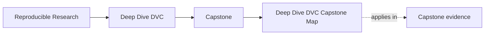
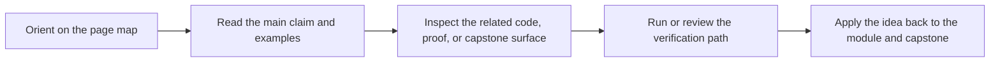

# Deep Dive DVC Capstone Map

<!-- page-maps:start -->
## Page Maps

<!-- page-maps:end -->

Read the first diagram as a timing map: the capstone is a corroboration surface, not the
first lesson. Read the second diagram as the route rule: choose one capstone route by
module or question, inspect the matching surface, then stop when one honest proof route
is visible.

## Enter the capstone at the right time

Enter only when the module idea is already legible in the local exercise.

Return to the module first if:

- you cannot yet explain the concept on a smaller repository
- you do not know which command should prove the behavior
- the repository feels larger than the concept you are studying

## Choose the route by question

| If the question is... | Start here | Escalate only if needed |
| --- | --- | --- |
| what this repository promises | [Capstone Guide](index.md) | [Capstone Walkthrough](capstone-walkthrough.md) |
| which repository surface matches the current module | the table below | [Capstone File Guide](capstone-file-guide.md) |
| which command should prove the current claim | [Command Guide](command-guide.md) | [Capstone Proof Guide](capstone-proof-guide.md) |
| what is safe for downstream trust | [Capstone Proof Guide](capstone-proof-guide.md) | [Capstone Review Worksheet](capstone-review-worksheet.md) |
| what survives local loss and remote restore | [Capstone Proof Guide](capstone-proof-guide.md) | [Capstone Review Worksheet](capstone-review-worksheet.md) |

## Choose the route by module arc

| Module arc | What should already be clear locally | First capstone route |
| --- | --- | --- |
| Modules 01-03 | state identity, cache truth, and environment boundaries | [Capstone Walkthrough](capstone-walkthrough.md) |
| Modules 04-06 | truthful stage edges, params, metrics, and experiment comparison | [Capstone File Guide](capstone-file-guide.md) |
| Modules 07-08 | collaboration pressure and recovery boundaries | [Capstone Proof Guide](capstone-proof-guide.md) |
| Modules 09-10 | downstream trust, migration boundaries, and stewardship judgment | [Capstone Review Worksheet](capstone-review-worksheet.md) |

## Module-to-capstone map

| Module | Main question | Capstone surface | First command |
| --- | --- | --- | --- |
| 01 Reproducibility Failures | why rerunnable scripts are weaker than explicit state contracts | `README.md`, `data/raw/`, [Capstone File Guide](capstone-file-guide.md) | `make walkthrough` |
| 02 Data Identity | what makes state durable instead of path-shaped | `dvc.lock`, `.dvc/cache`, `.dvc-remote/` | `make verify` |
| 03 Execution Environments | how runtime assumptions become explicit repository state | `Makefile`, `pyproject.toml`, `src/incident_escalation_capstone/` | `make verify` |
| 04 Truthful Pipelines | how declared stage edges differ from hopeful reruns | `dvc.yaml`, `dvc.lock`, `state/` | `make repro` |
| 05 Metrics and Parameters | which controls and metrics are safe to compare | `params.yaml`, `metrics/`, `publish/v1/metrics.json` | `make verify` |
| 06 Experiments | how to vary the control surface without mutating the baseline | `params.yaml`, experiment comparison bundle, `publish/v1/` | `make experiment-review` |
| 07 Collaboration and CI | which checks another maintainer can run without oral context | `Makefile`, `tests/`, [Review Route Guide](../capstone/docs/review-route-guide.md) | `make verify` |
| 08 Recovery and Scale | what survives cache loss and what depends on the remote | `.dvc-remote/`, `publish/v1/`, recovery bundle | `make recovery-review` |
| 09 Promotion and Auditability | what downstream users may trust from the promoted bundle | `publish/v1/`, `publish/v1/manifest.json`, `dvc.lock` | `make release-review` |
| 10 Governance and Migration | whether another maintainer could review or migrate the repository safely | `README.md`, `dvc.yaml`, `dvc.lock`, `publish/v1/` | `make confirm` |

## Good stopping point

Stop when you can name one capstone surface, one command, and one reason they are
enough for the current module or question. If you still feel pulled toward the whole
repository, step back to the smaller route.
