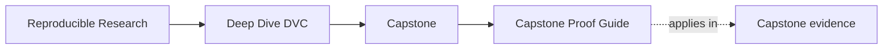
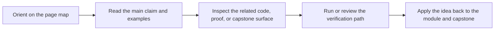

# Capstone Proof Guide

<!-- page-maps:start -->
## Page Maps

<!-- page-maps:end -->

Use this page when the question has moved from orientation to evidence. The goal is to
choose the smallest honest DVC proof route instead of escalating every question to full
repository confirmation.

## Choose the proof route by claim

| If you need to prove... | Start here | Escalate only if needed |
| --- | --- | --- |
| current repository state still matches the declared contract | `make PROGRAM=reproducible-research/deep-dive-dvc capstone-verify` | `make PROGRAM=reproducible-research/deep-dive-dvc capstone-verify-report` |
| a changed run is still comparable to the baseline | `make PROGRAM=reproducible-research/deep-dive-dvc capstone-experiment-review` | [Capstone Review Worksheet](capstone-review-worksheet.md) |
| recovery survives local loss because remote-backed state still exists | `make PROGRAM=reproducible-research/deep-dive-dvc capstone-recovery-review` | `make PROGRAM=reproducible-research/deep-dive-dvc capstone-confirm` |
| the publish boundary is safe for downstream trust | `make PROGRAM=reproducible-research/deep-dive-dvc capstone-release-review` | [Capstone Review Worksheet](capstone-review-worksheet.md) |
| the whole repository still deserves trust as a stewarded specimen | `make PROGRAM=reproducible-research/deep-dive-dvc capstone-confirm` | none |

## Read evidence in this order

1. command output or saved bundle
2. `capstone/dvc.lock`
3. `capstone/publish/v1/`
4. the matching implementation file only if the boundary still feels unclear

## What a strong proof review can answer

- which layer is authoritative for the current claim
- whether the proof is about ordinary verification, recovery durability, or downstream trust
- which next change would require a stronger route than the one you just used
