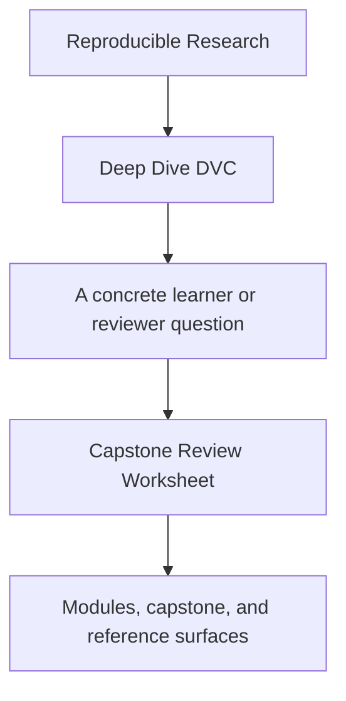
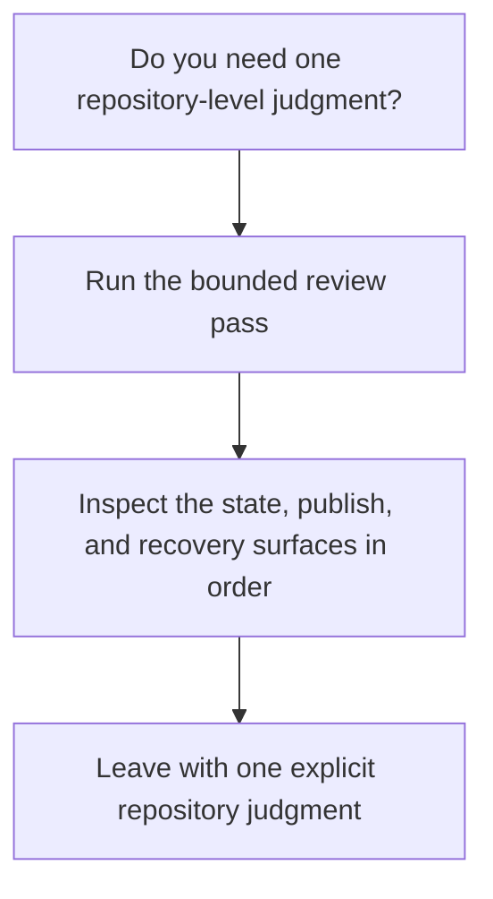

# Capstone Review Worksheet

<!-- page-maps:start -->
## Guide Fit

<!-- page-maps:end -->

Read the first diagram as a timing map: this worksheet is for one repository-level
review pass, not for first contact. Read the second diagram as the rule: inspect the
state, publish, and recovery surfaces in order, then leave with one explicit judgment.

Use this worksheet when reviewing the DVC capstone as a repository, not only as a lesson
artifact.

## Bounded review pass

1. Read `capstone/dvc.yaml`, `capstone/dvc.lock`, and `capstone/params.yaml`.
2. Inspect `capstone/publish/v1/` and `capstone/publish/v1/manifest.json`.
3. Review the recovery route through `make PROGRAM=reproducible-research/deep-dive-dvc capstone-recovery-review`.
4. Read the matching guides only if one of those surfaces stays unclear.

## Questions this pass should answer

- which state is authoritative for replay, comparison, and downstream trust
- whether declared pipeline state and recorded execution state still agree
- whether the promoted contract is smaller and clearer than the internal repository
- what recovery depends on locally and what depends on the remote

## Good stopping point

Stop when you can write one explicit judgment in your own words:

- trust the repository contract as-is
- trust it with one named boundary to revisit
- do not trust it yet because one specific state or recovery surface is still missing

If you cannot make one of those judgments, repeat the bounded pass before widening the
review surface.

## Best follow-up routes

- Read [Capstone File Guide](capstone-file-guide.md) when the open question is file ownership.
- Read [Release Audit Checklist](release-audit-checklist.md) when the open question is downstream trust.
- Read [Recovery Review Guide](recovery-review-guide.md) when the open question is restore evidence.
