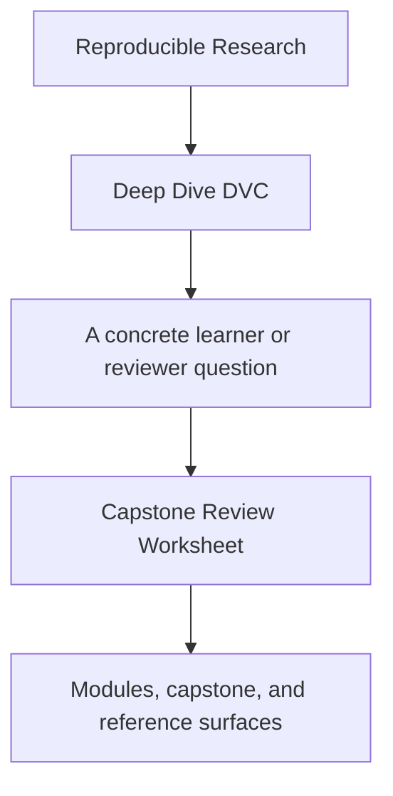
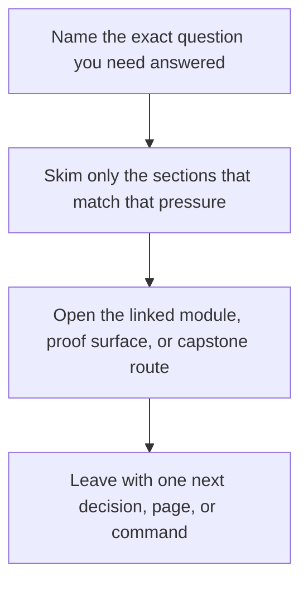

# Capstone Review Worksheet

<!-- page-maps:start -->
## Guide Fit

<!-- page-maps:end -->

Read the first diagram as a timing map: this guide is for a named pressure, not for wandering the whole course-book. Read the second diagram as the guide loop: arrive with a concrete question, use only the matching sections, then leave with one smaller and more honest next move.

Use this worksheet when reviewing the DVC capstone as a repository, not only as a lesson
artifact.

The point is to make review concrete enough that another maintainer could compare your
judgment with the same evidence.

---

## Repository Contract

Answer these first:

1. What is the repository claiming to track and defend?
2. Which state is authoritative for replay, comparison, and downstream trust?
3. Which files define the promoted contract?

[Back to top](#top)

---

## Pipeline Truth

Review these surfaces together:

* `capstone/dvc.yaml`
* `capstone/dvc.lock`
* `capstone/params.yaml`

Write down:

1. which stages declare meaningful dependencies
2. which params change execution meaning
3. whether the lock evidence looks consistent with the declaration

[Back to top](#top)

---

## Publish Boundary

Review these surfaces together:

* `capstone/publish/v1/`
* `capstone/publish/v1/manifest.json`
* `capstone/publish/v1/report.md`

Write down:

1. which artifacts are safe for downstream trust
2. which artifacts remain internal repository state
3. whether the promoted contract is smaller and clearer than the whole repository

[Back to top](#top)

---

## Recovery And Durability

Review these surfaces together:

* `make -C capstone recovery-drill`
* the local DVC remote configuration
* the published bundle after restoration

Write down:

1. what survives local cache loss
2. which guarantees depend on the remote
3. what evidence proves restoration succeeded

[Back to top](#top)

---

## Final Review Questions

Finish with these:

* what is the repository's strongest design choice
* what is the most fragile boundary
* what would you inspect first before approving a migration
* what would you refuse to change without new evidence

[Back to top](#top)
