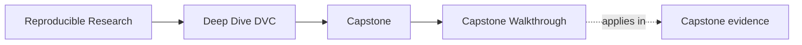
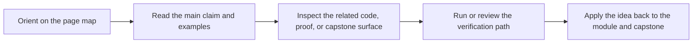

# Capstone Walkthrough

<!-- page-maps:start -->
## Page Maps

<!-- page-maps:end -->

Use this page when you want the first honest pass through the DVC capstone. The goal is
to understand the repository contract, state story, and publish boundary before widening
into stronger review routes.

## Walkthrough route

1. Run `make PROGRAM=reproducible-research/deep-dive-dvc capstone-walkthrough`.
2. Read `capstone/dvc.yaml`, `capstone/dvc.lock`, and `capstone/params.yaml` in that order.
3. Open `capstone/src/incident_escalation_capstone/publish.py`.
4. Inspect `capstone/publish/v1/manifest.json`.
5. Read [Capstone File Guide](capstone-file-guide.md) or [Capstone Architecture Guide](capstone-architecture-guide.md) only if ownership is still unclear.

## What the walkthrough should teach

- where declaration ends and recorded execution state begins
- which promoted files another person may trust downstream
- which questions need ordinary verification versus recovery or release review

## Stop here when

- you can name the authoritative file for declaration, recorded state, and promotion
- you know whether your next step is verification, recovery review, or stewardship review
