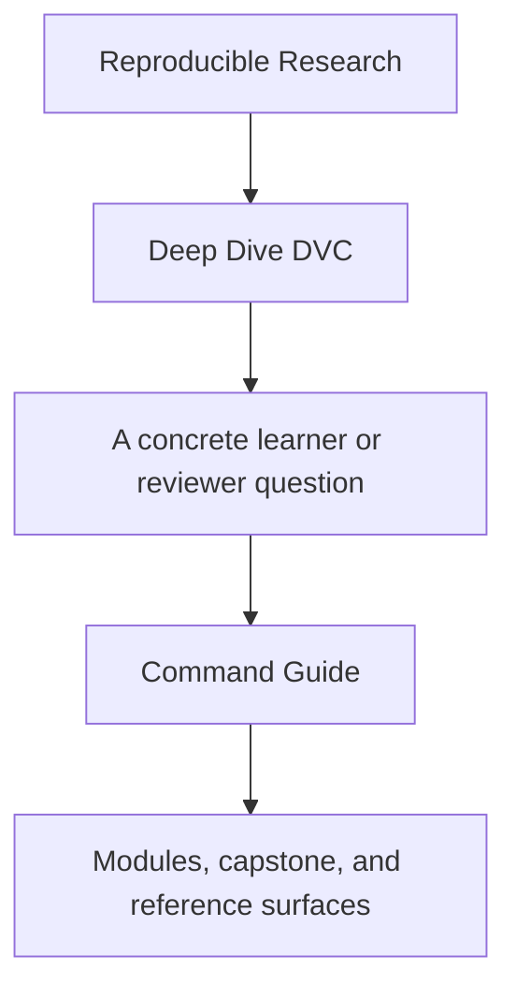
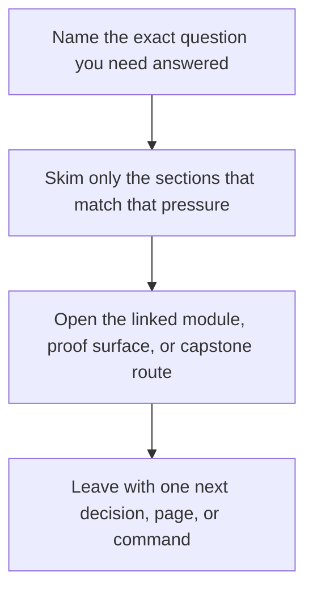

<a id="top"></a>

# Command Guide


<!-- page-maps:start -->
## Guide Fit




<!-- page-maps:end -->

Read the first diagram as a timing map: this guide is for a named pressure, not for wandering the whole course-book. Read the second diagram as the guide loop: arrive with a concrete question, use only the matching sections, then leave with one smaller and more honest next move.

Deep Dive DVC has three command layers: repository root, program directory, and capstone
directory. This page makes those boundaries explicit.

Use it when you know what proof question you have but are not sure where the command
belongs.

---

## Repository Root

Use root-level commands when you want one entrypoint that works across programs.

| Command | What it does |
| --- | --- |
| `make PROGRAM=reproducible-research/deep-dive-dvc program-help` | show the program Makefile surface |
| `make PROGRAM=reproducible-research/deep-dive-dvc docs-build` | build the course docs in strict mode |
| `make PROGRAM=reproducible-research/deep-dive-dvc capstone-walkthrough` | build the learner-first capstone walkthrough bundle |
| `make PROGRAM=reproducible-research/deep-dive-dvc capstone-tour` | build the executed capstone proof bundle |
| `make PROGRAM=reproducible-research/deep-dive-dvc capstone-state-summary` | render the combined declaration, execution, and release summary |
| `make PROGRAM=reproducible-research/deep-dive-dvc capstone-release-summary` | render the promoted release summary |
| `make PROGRAM=reproducible-research/deep-dive-dvc capstone-review-queue` | render the structured prediction review queue |
| `make PROGRAM=reproducible-research/deep-dive-dvc capstone-verify` | validate the promoted contract through the public root surface |
| `make PROGRAM=reproducible-research/deep-dive-dvc capstone-experiment-review` | build the experiment comparison bundle |
| `make PROGRAM=reproducible-research/deep-dive-dvc capstone-release-review` | build the release review bundle |
| `make PROGRAM=reproducible-research/deep-dive-dvc capstone-recovery-review` | build the recovery review bundle |
| `make PROGRAM=reproducible-research/deep-dive-dvc capstone-confirm` | run the strongest repository-wide capstone proof route |
| `make PROGRAM=reproducible-research/deep-dive-dvc test` | run the course's main verification target |

[Back to top](#top)

---

## Program Directory

Use `programs/reproducible-research/deep-dive-dvc/` when you want the course-local
surface.

| Command | What it does |
| --- | --- |
| `make help` | show program-level targets |
| `make test` | run the capstone confirmation suite via the program surface |
| `make capstone-walkthrough` | build the learner-first walkthrough bundle |
| `make capstone-tour` | build the executed capstone proof bundle |
| `make capstone-state-summary` | render the combined state summary |
| `make capstone-release-summary` | render the promoted release summary |
| `make capstone-review-queue` | render the structured review queue |
| `make capstone-verify` | run the capstone contract verification route |
| `make capstone-experiment-review` | build the experiment comparison bundle |
| `make capstone-release-review` | build the release review bundle |
| `make capstone-recovery-review` | build the recovery review bundle |
| `make capstone-confirm` | run the strongest capstone confirmation route |
| `make clean` | remove program and capstone build artifacts |

[Back to top](#top)

---

## Capstone Directory

Use `capstone/` when you want the raw executable DVC repository.

| Command | What it does |
| --- | --- |
| `make help` | show public capstone targets |
| `make walkthrough` | build the learner-first reading bundle without executing the workflow |
| `make repro` | execute the DVC pipeline |
| `make state-summary` | render the combined declaration, execution, and release summary |
| `make release-summary` | render the promoted release summary |
| `make review-queue` | render the structured prediction review queue |
| `make verify` | run the pipeline and validate the promoted contract |
| `make experiment-review` | build the experiment comparison bundle |
| `make release-review` | build the release review bundle |
| `make confirm` | run verification, tests, and the recovery drill |
| `make recovery-drill` | prove remote-backed restoration after local loss |
| `make recovery-review` | build the remote-backed recovery review bundle |
| `make tour` | build the executed proof bundle |

[Back to top](#top)

---

## Best Defaults

If you are new:

```sh
make PROGRAM=reproducible-research/deep-dive-dvc capstone-walkthrough
make PROGRAM=reproducible-research/deep-dive-dvc capstone-verify
make PROGRAM=reproducible-research/deep-dive-dvc capstone-state-summary
```

If you are reviewing the capstone deeply:

```sh
make PROGRAM=reproducible-research/deep-dive-dvc capstone-tour
make PROGRAM=reproducible-research/deep-dive-dvc capstone-release-review
make PROGRAM=reproducible-research/deep-dive-dvc capstone-confirm
make -C capstone help
```

Use [`verification-route-guide.md`](../reference/verification-route-guide.md) when you need to choose
between `walkthrough`, `verify`, `confirm`, `recovery-drill`, and `tour`.

[Back to top](#top)
