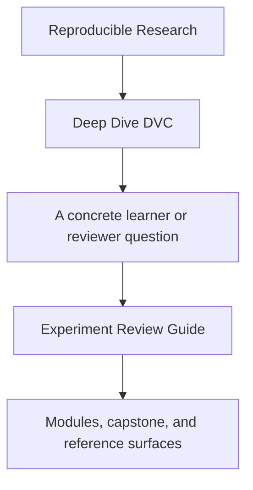
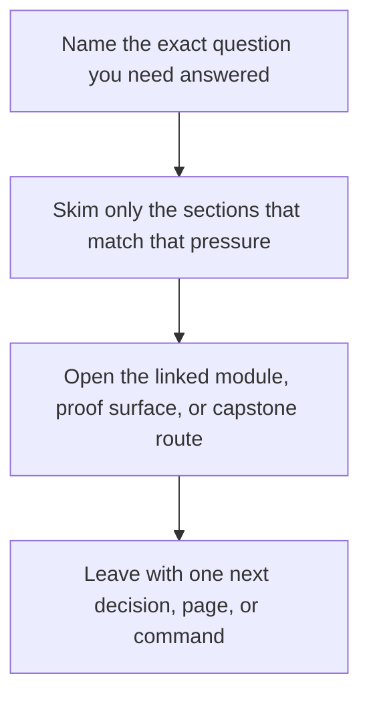

# Experiment Review Guide

<!-- page-maps:start -->
## Guide Fit

<!-- page-maps:end -->

Read the first diagram as a timing map: this guide is for a named pressure, not for wandering the whole course-book. Read the second diagram as the guide loop: arrive with a concrete question, use only the matching sections, then leave with one smaller and more honest next move.

Use this guide when the course reaches Module 06 or when you need to review whether a
DVC experiment is disciplined rather than chaotic.

## Review rule

An experiment is only reviewable if you can say:

- what changed
- why the result is still comparable
- what metric movement matters
- what still needs release-boundary evidence before promotion

## Best companion pages

- [Evidence Boundary Guide](../reference/evidence-boundary-guide.md)
- [Verification Route Guide](../reference/verification-route-guide.md)
- [Capstone Map](capstone-map.md)
