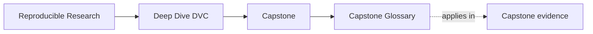
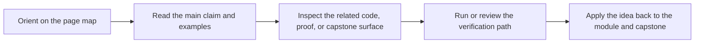

# Capstone Glossary

<!-- page-maps:start -->
## Page Maps

<!-- page-maps:end -->

Use this page when the DVC capstone routes start to blur together. The goal is not to
add more jargon. The goal is to keep review attached to the right boundary.

| Term | Meaning here |
| --- | --- |
| walkthrough | the bounded first pass through the repository without widening into stronger review routes |
| proof route | the smallest honest command or saved bundle that can corroborate the current claim |
| authoritative layer | the file or state surface that should win when multiple surfaces seem to disagree |
| declared state | the intended pipeline contract recorded in files such as `dvc.yaml` and `params.yaml` |
| recorded state | the executed pipeline outcome recorded in files such as `dvc.lock` and saved bundles |
| promoted contract | the smaller downstream-facing bundle another person is allowed to trust |
| recovery evidence | the artifacts that show what survives local loss because the remote still has authority |
| stewardship review | the stronger route used when a maintainer must judge the whole repository, not one claim |
