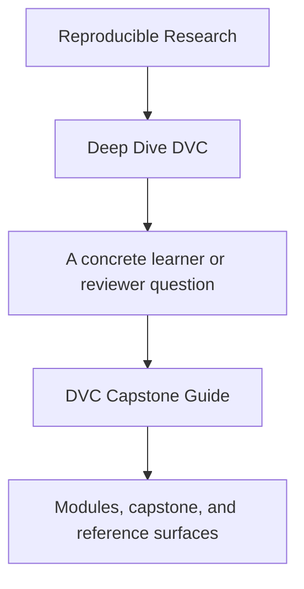
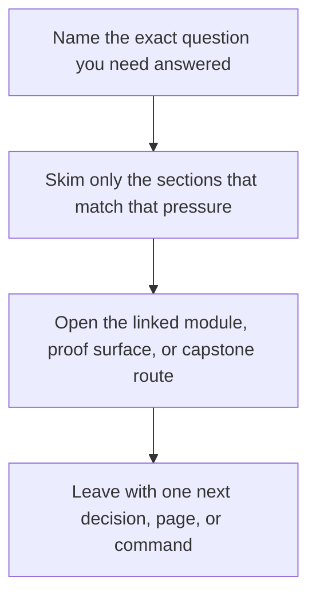

# DVC Capstone Guide


<!-- page-maps:start -->
## Guide Fit




<!-- page-maps:end -->

Read the first diagram as a timing map: this guide is for a named pressure, not for wandering the whole course-book. Read the second diagram as the guide loop: arrive with a concrete question, use only the matching sections, then leave with one smaller and more honest next move.

The DVC capstone is the course’s executable proof. It is where the course stops making
claims in prose and starts exposing state that can be inspected, reproduced, compared,
and restored.

## What this capstone is proving

The capstone is a small incident-escalation prediction repository with:

- committed source data
- a truthful four-stage `dvc.yaml` graph
- declared parameters in `params.yaml`
- tracked metrics and predictions
- a stable `publish/v1/` boundary
- a recovery drill that rebuilds the workspace from a DVC remote after cache loss

Its size is deliberate. The repository is small enough to study completely and large
enough to force real design choices about state.

## How to use it while reading

- After Module 02, inspect which artifacts are identity-bearing state and which are projections.
- After Module 04, inspect `dvc.yaml` and `dvc.lock` together and ask whether every meaningful edge is declared.
- After Module 06, inspect `params.yaml`, metrics, and the publish bundle and ask what makes runs comparable.
- After Module 07 and Module 08, inspect the push and recovery targets and ask which guarantees depend on remote durability.
- After Module 09, inspect `publish/v1/`, `manifest.json`, and promoted params or metrics as the release boundary.
- In Module 10, use the repository as a review specimen for stewardship judgment rather than a first-contact example.

If you want a module-by-module route through the repository, start with
[Capstone Map](capstone-map.md).

## Best capstone entry by learning stage

Use the capstone differently as the course advances:

| Learning stage | Best starting page | Best first command | Why this is the right entry |
| --- | --- | --- | --- |
| Modules 01-03 | [Capstone Map](capstone-map.md) | `make PROGRAM=reproducible-research/deep-dive-dvc capstone-walkthrough` | keep the repository as a specimen while the state model is still forming |
| Modules 04-06 | [Repository Layer Guide](repository-layer-guide.md) | `make PROGRAM=reproducible-research/deep-dive-dvc capstone-repro` or `make PROGRAM=reproducible-research/deep-dive-dvc capstone-verify` | inspect truthful execution, params, metrics, and experiment boundaries directly |
| Modules 07-08 | [Recovery Review Guide](recovery-review-guide.md) | `make PROGRAM=reproducible-research/deep-dive-dvc capstone-confirm` or `make PROGRAM=reproducible-research/deep-dive-dvc capstone-recovery-review` | inspect what another maintainer can verify and restore under pressure |
| Modules 09-10 | [Release Review Guide](release-review-guide.md) | `make PROGRAM=reproducible-research/deep-dive-dvc capstone-release-review` or `make PROGRAM=reproducible-research/deep-dive-dvc capstone-confirm` | review promoted trust surfaces, governance, and repository stewardship |

If the pressure is "can I hand someone a clean source artifact?", start with
[Capstone File Guide](capstone-file-guide.md) and run `make PROGRAM=reproducible-research/deep-dive-dvc capstone-source-bundle`.

## Best entrypoints

- Capstone map: [capstone-map.md](capstone-map.md)
- Capstone architecture: [capstone-architecture-guide.md](capstone-architecture-guide.md)
- Repository layer guide: [repository-layer-guide.md](repository-layer-guide.md)
- Verification route guide: [../reference/verification-route-guide.md](../reference/verification-route-guide.md)
- Capstone file guide: [capstone-file-guide.md](capstone-file-guide.md)
- Experiment route: [experiment-review-guide.md](experiment-review-guide.md)
- Recovery route: [recovery-review-guide.md](recovery-review-guide.md)
- Release route: [release-review-guide.md](release-review-guide.md)
- Pipeline graph: `capstone/dvc.yaml`
- Declared inputs: `capstone/params.yaml`
- Verification logic: `capstone/src/incident_escalation_capstone/verify.py`

## Core commands

```bash
make PROGRAM=reproducible-research/deep-dive-dvc capstone-walkthrough
make PROGRAM=reproducible-research/deep-dive-dvc capstone-repro
make PROGRAM=reproducible-research/deep-dive-dvc capstone-verify
make PROGRAM=reproducible-research/deep-dive-dvc capstone-experiment-review
make PROGRAM=reproducible-research/deep-dive-dvc capstone-release-review
make PROGRAM=reproducible-research/deep-dive-dvc capstone-recovery-review
make PROGRAM=reproducible-research/deep-dive-dvc capstone-confirm
make PROGRAM=reproducible-research/deep-dive-dvc capstone-tour
make PROGRAM=reproducible-research/deep-dive-dvc capstone-source-bundle
```

## What to inspect during review

- Which state is authoritative and which state is derived?
- Which parameter changes should invalidate comparisons?
- Which artifacts are safe to promote to downstream consumers?
- Which guarantees would disappear if the local cache were deleted today?

## Directory glossary

Use [Glossary](glossary.md) when you want the recurring language in this shelf kept stable while you move between repository routes, review surfaces, and proof commands.
