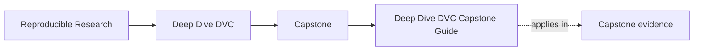
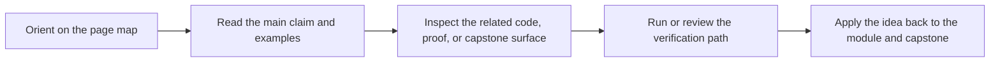

# Deep Dive DVC Capstone Guide

<!-- page-maps:start -->
## Page Maps

<!-- page-maps:end -->

This capstone is the executable reference repository for Deep Dive DVC. It keeps state
authority, promotion, and recovery visible in one place so the course's biggest claims
can be inspected instead of repeated from memory.

Use this guide once the local module idea is already clear. The capstone should
corroborate a concept, not replace first contact with it.

## What this capstone proves

- state identity can stay explicit instead of path-shaped
- declared pipeline contracts and recorded execution state can be compared directly
- promoted outputs can be smaller and clearer than the whole repository
- recovery can depend on remote-backed durability instead of hopeful local convenience

## Choose the right capstone route

| If your question is... | Best page |
| --- | --- |
| Which capstone surface matches the current module? | [Capstone Map](capstone-map.md) |
| Which files and state surfaces matter first? | [Capstone File Guide](capstone-file-guide.md) |
| Where do declaration, execution, promotion, and recovery live? | [Capstone Architecture Guide](capstone-architecture-guide.md) |
| Which proof route is honest for this claim? | [Capstone Proof Guide](capstone-proof-guide.md) |
| How should I review the repository as a steward? | [Capstone Review Worksheet](capstone-review-worksheet.md) |
| Where should a new change land? | [Capstone Extension Guide](capstone-extension-guide.md) |

## Start by module range

| Module range | Best capstone focus |
| --- | --- |
| Modules 01-03 | state identity, cache truth, and environment boundaries |
| Modules 04-06 | stage edges, params, metrics, and comparable runs |
| Modules 07-08 | collaboration pressure, remote durability, and recovery |
| Modules 09-10 | promoted trust surfaces, migration boundaries, and stewardship review |

## Core commands

| If you need... | From the repository root | From the capstone directory |
| --- | --- | --- |
| the first bounded pass | `make PROGRAM=reproducible-research/deep-dive-dvc capstone-walkthrough` | `make walkthrough` |
| current-state verification | `make PROGRAM=reproducible-research/deep-dive-dvc capstone-verify` | `make verify` |
| recovery or release review | `make PROGRAM=reproducible-research/deep-dive-dvc capstone-recovery-review` or `make PROGRAM=reproducible-research/deep-dive-dvc capstone-release-review` | `make recovery-review` or `make release-review` |

## Guide set

- [Capstone Map](capstone-map.md)
- [Capstone Walkthrough](capstone-walkthrough.md)
- [Command Guide](command-guide.md)
- [Capstone File Guide](capstone-file-guide.md)
- [Capstone Architecture Guide](capstone-architecture-guide.md)
- [Capstone Proof Guide](capstone-proof-guide.md)
- [Capstone Review Worksheet](capstone-review-worksheet.md)
- [Capstone Extension Guide](capstone-extension-guide.md)
- [Glossary](glossary.md)

## Review questions

- Which layer is authoritative for the current question?
- Which file records the difference between declaration and execution?
- Which promoted files may another person trust downstream?
- Which guarantees depend on the DVC remote rather than local convenience?

## Stop here when

- you know which state surface or command owns the current question
- you know whether the next move is walkthrough, proof, or stewardship review
- you know the smallest route that can answer honestly
