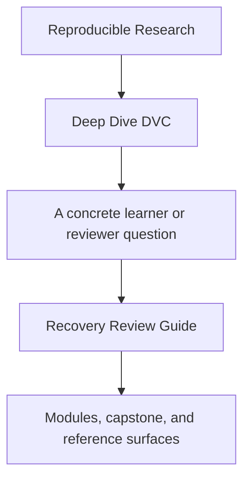
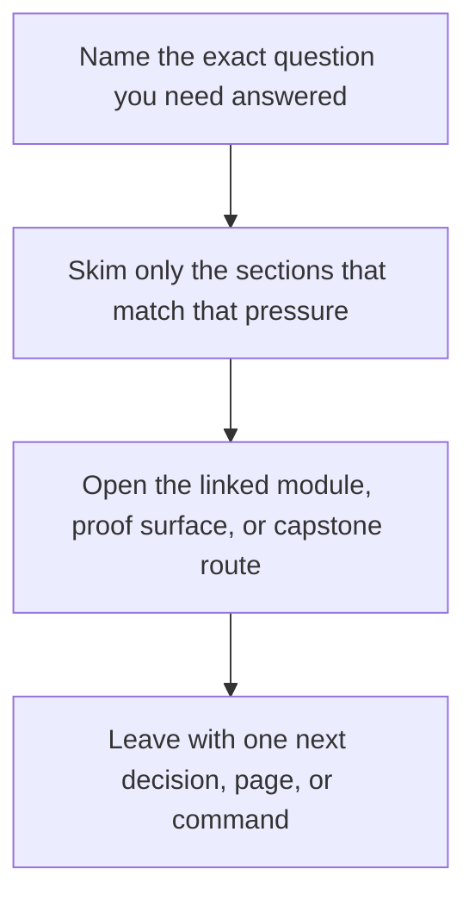

# Recovery Review Guide

<!-- page-maps:start -->
## Guide Fit

<!-- page-maps:end -->

Read the first diagram as a timing map: this guide is for a named pressure, not for wandering the whole course-book. Read the second diagram as the guide loop: arrive with a concrete question, use only the matching sections, then leave with one smaller and more honest next move.

Use this guide when studying Module 08 or when reviewing whether the capstone’s recovery
story is real rather than aspirational.

## Questions to answer

- Which restored artifacts came from the remote rather than the working tree?
- Which downstream trust claims survive because `publish/v1/` and `dvc.lock` were restored together?
- Which repository facts still require internal evidence beyond the publish bundle?

## Best route

1. Read [Authority Map](../reference/authority-map.md).
2. Run `make -C capstone recovery-drill`.
3. Run `make -C capstone recovery-review`.
4. Read [Repository Layer Guide](repository-layer-guide.md).
5. Inspect the recovery bundle beside [Evidence Boundary Guide](../reference/evidence-boundary-guide.md).
