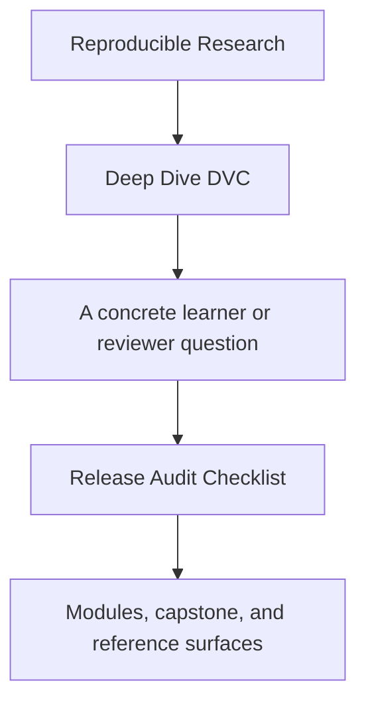
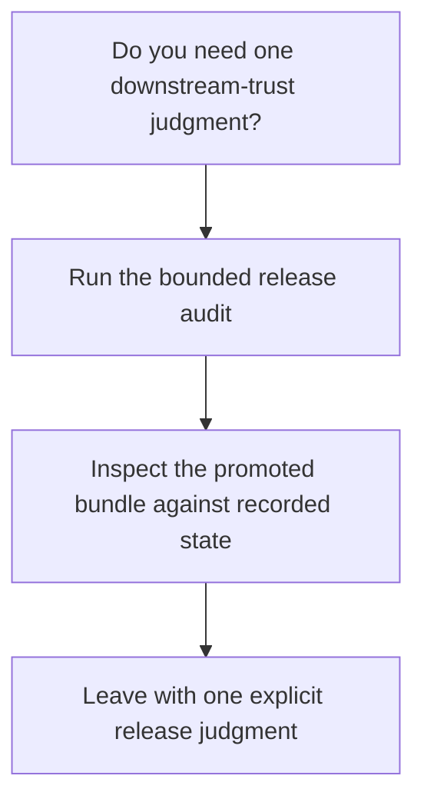

# Release Audit Checklist

<!-- page-maps:start -->
## Guide Fit

<!-- page-maps:end -->

Read the first diagram as a timing map: this checklist is for one release-boundary
decision, not for whole-repository review. Read the second diagram as the rule: inspect
the promoted bundle against recorded state, then leave with one explicit release
judgment.

Use this page when the question is narrower than "is this repository good?" and more
specific than "is this promoted contract safe to trust downstream?"

## Bounded release audit

1. Run `make PROGRAM=reproducible-research/deep-dive-dvc capstone-verify`.
2. Inspect `capstone/publish/v1/manifest.json`.
3. Inspect `capstone/publish/v1/metrics.json` and `capstone/publish/v1/params.yaml`.
4. Compare the promoted bundle against `capstone/dvc.lock`.
5. Run `make PROGRAM=reproducible-research/deep-dive-dvc capstone-release-review` only if the release boundary still feels unclear.

## Questions this audit should answer

- which promoted artifacts are intended for downstream trust
- whether every promoted artifact is traceable back to recorded repository state
- whether the promoted bundle stays smaller and clearer than the internal repository
- whether another reviewer could tell what not to trust from the promoted bundle alone

## Failure signs

- the manifest names files but not their review meaning
- promoted metrics are present but their comparison contract is ambiguous
- promoted params exist but their decision relevance is unclear
- the promoted bundle looks like a raw dump of internal repository state
- you need oral context from the author to know what downstream users may rely on

## Good stopping point

Stop when you can write one explicit release judgment:

- trust this promoted contract as-is
- trust it with one named clarification to add
- do not trust it yet because one exact promoted surface is still ambiguous

If you cannot make one of those judgments, repeat the bounded audit before expanding to
broader repository review.

## Best companion pages

- [Capstone Review Worksheet](capstone-review-worksheet.md)
- [Evidence Boundary Guide](../reference/evidence-boundary-guide.md)
- [Proof Matrix](../guides/proof-matrix.md)
- [Capstone Extension Guide](capstone-extension-guide.md)
