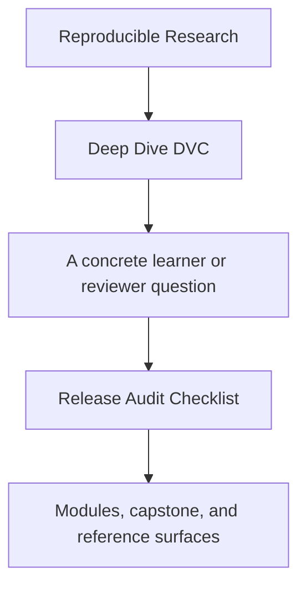
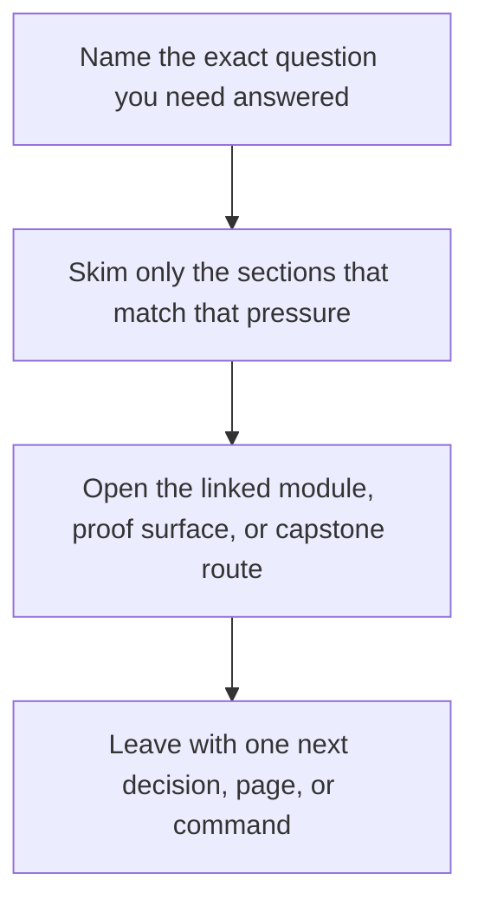

# Release Audit Checklist

<!-- page-maps:start -->
## Guide Fit

<!-- page-maps:end -->

Read the first diagram as a timing map: this guide is for a named pressure, not for wandering the whole course-book. Read the second diagram as the guide loop: arrive with a concrete question, use only the matching sections, then leave with one smaller and more honest next move.

Use this checklist when the question is narrower than "is this repository good?" and more
specific than "is this promoted contract safe to trust downstream?"

This page focuses on `publish/v1/` as a release boundary, not on the whole repository.

---

## Contract Surfaces To Inspect

Review these together:

* `capstone/publish/v1/manifest.json`
* `capstone/publish/v1/metrics.json`
* `capstone/publish/v1/params.yaml`
* `capstone/publish/v1/report.md`
* `capstone/dvc.lock`

Write down whether each promoted artifact is traceable back to recorded repository state.

[Back to top](#top)

---

## Release Questions

Answer these before approving the promoted contract:

1. Which exact artifacts are intended for downstream trust?
2. Which inputs, params, and metrics are named clearly enough to stay meaningful later?
3. Does the promoted bundle stay smaller than the full internal repository story?
4. Can you trace the promoted outputs back to recorded execution evidence in `dvc.lock`?
5. Would another reviewer know what not to trust from the promoted bundle alone?

[Back to top](#top)

---

## Failure Signs

Treat these as warnings:

* the manifest names files but not their review meaning
* promoted metrics are present but their comparison contract is ambiguous
* promoted params exist but their decision relevance is unclear
* the promoted bundle looks like a raw dump of internal repository state
* you need oral context from the author to understand what downstream users may rely on

[Back to top](#top)

---

## Best Audit Route

Use this order:

1. `make -C capstone verify`
2. inspect `capstone/publish/v1/manifest.json`
3. inspect `capstone/publish/v1/metrics.json` and `capstone/publish/v1/params.yaml`
4. compare the promoted contract against `capstone/dvc.lock`
5. run `make -C capstone tour` if you want the executed proof bundle collected in one place

That keeps the audit grounded in recorded evidence instead of presentation alone.

[Back to top](#top)

---

## Best Companion Pages

The most useful companion pages for this checklist are:

* [`capstone-review-worksheet.md`](capstone-review-worksheet.md)
* [`evidence-boundary-guide.md`](../reference/evidence-boundary-guide.md)
* [`proof-matrix.md`](../guides/proof-matrix.md)
* [`capstone-extension-guide.md`](capstone-extension-guide.md)

[Back to top](#top)
