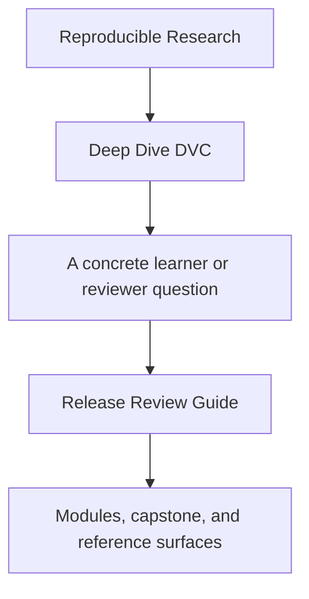
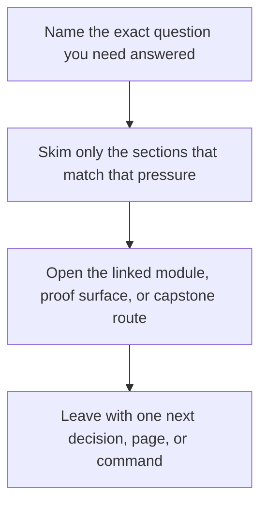

# Release Review Guide

<!-- page-maps:start -->
## Guide Fit

<!-- page-maps:end -->

Read the first diagram as a timing map: this guide is for a named pressure, not for wandering the whole course-book. Read the second diagram as the guide loop: arrive with a concrete question, use only the matching sections, then leave with one smaller and more honest next move.

Use this guide when studying promotion and auditability.

## Review questions

- Which promoted files are part of the downstream contract, and which are intentionally excluded?
- Which trust claims come from the publish bundle alone, and which still require repository-internal evidence?
- Which params and metrics remain meaningful enough for later review?

## Best companion pages

- [Release Audit Checklist](release-audit-checklist.md)
- [Evidence Boundary Guide](../reference/evidence-boundary-guide.md)
- [Capstone Review Worksheet](capstone-review-worksheet.md)
