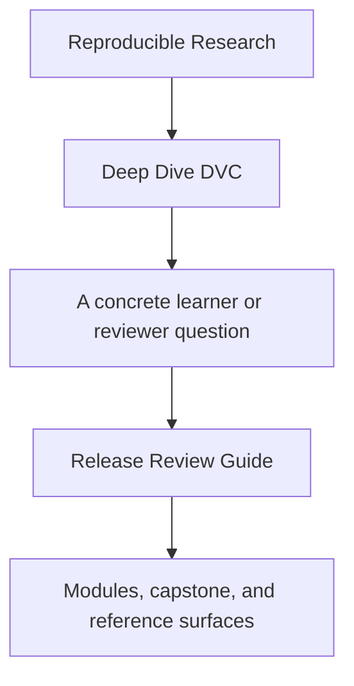
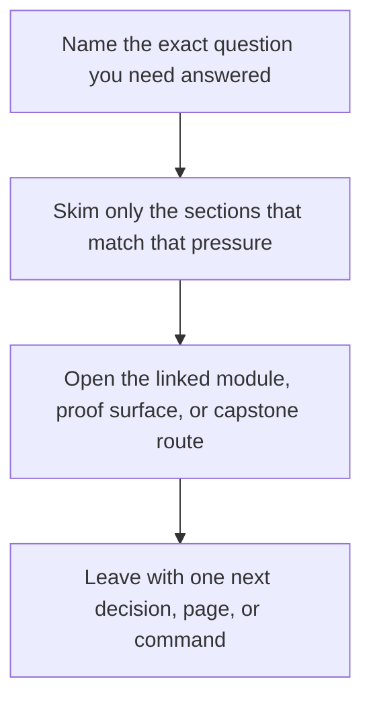

# Release Review Guide

<!-- page-maps:start -->
## Guide Fit

<!-- page-maps:end -->

Read the first diagram as a timing map: this guide is for a named pressure, not for wandering the whole course-book. Read the second diagram as the guide loop: arrive with a concrete question, use only the matching sections, then leave with one smaller and more honest next move.

Use this guide when studying promotion and auditability.

## Bounded release audit

Use this route when the question is narrower than "is this repository good?" and more
specific than "is this promoted contract safe to trust downstream?"

1. Run `make PROGRAM=reproducible-research/deep-dive-dvc capstone-verify`.
2. Inspect `capstone/publish/v1/manifest.json`.
3. Inspect `capstone/publish/v1/metrics.json` and `capstone/publish/v1/params.yaml`.
4. Compare the promoted bundle against `capstone/dvc.lock`.
5. Run `make PROGRAM=reproducible-research/deep-dive-dvc capstone-release-review` only if the release boundary still feels unclear.

## Review questions

- Which promoted files are part of the downstream contract, and which are intentionally excluded?
- Which trust claims come from the publish bundle alone, and which still require repository-internal evidence?
- Which params and metrics remain meaningful enough for later review?

## Failure signs

- the manifest names files but not their review meaning
- promoted metrics are present but their comparison contract is ambiguous
- promoted params exist but their decision relevance is unclear
- the promoted bundle looks like a raw dump of internal repository state
- you need oral context from the author to know what downstream users may rely on

## Good stopping point

Stop when you can write one explicit release judgment:

- trust this promoted contract as-is
- trust it with one named clarification to add
- do not trust it yet because one exact promoted surface is still ambiguous

If you cannot make one of those judgments, repeat the bounded audit before expanding to
broader repository review.

## Best companion pages

- [Evidence Boundary Guide](../reference/evidence-boundary-guide.md)
- [Capstone Review Worksheet](capstone-review-worksheet.md)
- [Capstone Extension Guide](capstone-extension-guide.md)
