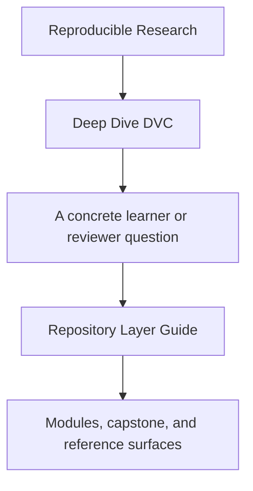
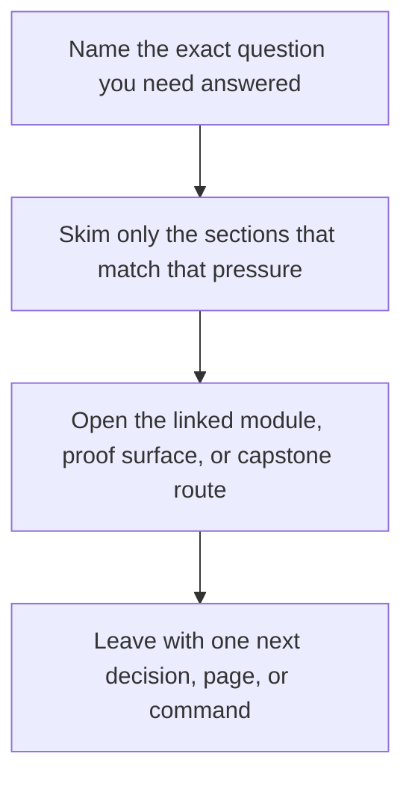

# Repository Layer Guide

<!-- page-maps:start -->
## Guide Fit

<!-- page-maps:end -->

Read the first diagram as a timing map: this guide is for a named pressure, not for wandering the whole course-book. Read the second diagram as the guide loop: arrive with a concrete question, use only the matching sections, then leave with one smaller and more honest next move.

The DVC capstone becomes much easier to read once its files are grouped by responsibility
instead of by directory names alone.

Use this guide when the repository feels crowded and you need to know which layer you are
actually reading.

---

## Repository Layers

| Layer | Main surfaces | Responsibility |
| --- | --- | --- |
| course-facing contract | [DVC Capstone Guide](index.md), [Capstone Map](capstone-map.md), `course-book/capstone/index.md` | explain what the repository is trying to prove |
| declared workflow | `capstone/dvc.yaml`, `capstone/params.yaml`, `capstone/pyproject.toml` | declare the intended execution graph and control surface |
| recorded workflow state | `capstone/dvc.lock` | record the exact state transition after execution |
| implementation | `capstone/src/incident_escalation_capstone/` | implement the stages the workflow declares |
| internal outputs | `capstone/state/`, `capstone/metrics/`, `capstone/models/`, `capstone/data/derived/` | hold internal repository evidence and generated state |
| promoted contract | `capstone/publish/v1/` | expose the smaller, reviewable bundle downstream users may trust |
| durability layer | `capstone/.dvc/`, `capstone/.dvc-remote/`, DVC cache | support restoration, synchronization, and long-term recovery |
| experiment comparison layer | experiment runs, params deltas, comparison bundles | explain why one changed run is comparable to the baseline |

[Back to top](#top)

---

## How To Read The Layers In Order

Use this sequence the first time:

1. read [DVC Capstone Guide](index.md) to understand the repository claim
2. read `capstone/dvc.yaml` and `capstone/params.yaml` to inspect the declared contract
3. read `capstone/dvc.lock` to inspect recorded execution evidence
4. inspect `capstone/src/incident_escalation_capstone/` only after the declared graph is clear
5. inspect `capstone/publish/v1/` to see what the repository promotes for downstream trust
6. inspect experiment comparison surfaces when evaluating changed params
7. inspect recovery surfaces only after you understand what state should survive loss

That order keeps the learner focused on contract first and mechanics second.

[Back to top](#top)

---

## Layer Questions

| Question | Best layer to inspect first |
| --- | --- |
| what is this repository promising to defend | course-facing contract |
| what should happen when the pipeline runs | declared workflow |
| what did happen on the recorded run | recorded workflow state |
| where is the behavior actually implemented | implementation |
| which generated artifacts are only internal | internal outputs |
| what may a downstream reviewer rely on | promoted contract |
| what survives local loss | durability layer |
| what makes one changed run meaningfully comparable to the baseline | experiment comparison layer |

[Back to top](#top)

---

## Common Reading Mistakes

| Mistake | Why it weakens understanding |
| --- | --- |
| reading `src/` before `dvc.yaml` | implementation details hide the declared contract |
| treating `publish/v1/` as the whole repository | promoted state is intentionally smaller than the internal story |
| treating `dvc.lock` as another copy of `dvc.yaml` | recorded execution evidence is not the same as declaration |
| jumping to cache or remote details first | durability questions make sense only after authority is clear |

[Back to top](#top)

---

## Best Companion Pages

The most useful companion pages for this guide are:

* [`capstone-file-guide.md`](capstone-file-guide.md)
* [`authority-map.md`](../reference/authority-map.md)
* [`capstone-map.md`](capstone-map.md)
* [`proof-matrix.md`](../guides/proof-matrix.md)

[Back to top](#top)
