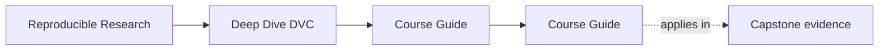
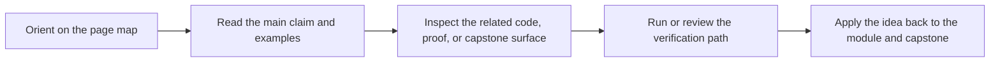

<a id="top"></a>

# Course Guide


<!-- page-maps:start -->
## Page Maps




<!-- page-maps:end -->

Deep Dive DVC now has enough support pages that learners need one stable hub for finding
the right surface quickly.

This guide groups the course by the question you are trying to answer.

---

## If You Are New Here

Start with these pages in order:

1. [`start-here.md`](start-here.md)
2. [`module-00.md`](module-00.md)
3. [`learning-contract.md`](learning-contract.md)
4. [`module-dependency-map.md`](module-dependency-map.md)
5. [`platform-setup.md`](platform-setup.md) if you plan to run local proof commands

Then begin Module 01.

[Back to top](#top)

---

## If You Need A Stable Reference

Use these pages when you already know the course but need a fast answer:

* [`state-glossary.md`](state-glossary.md) for shared vocabulary
* [`authority-map.md`](authority-map.md) for which layer settles a trust question
* [`practice-map.md`](practice-map.md) for the right proof route
* [`command-guide.md`](command-guide.md) for command boundaries
* [`proof-matrix.md`](proof-matrix.md) for claims-to-evidence routing
* [`capstone-file-guide.md`](capstone-file-guide.md) for file responsibilities
* [`capstone-map.md`](capstone-map.md) for module-to-repository routing

[Back to top](#top)

---

## If You Need The Capstone

Use these pages when the concept is already legible and you want the executable
repository:

* [`readme-capstone.md`](readme-capstone.md) for the repository contract
* [`capstone-map.md`](capstone-map.md) for the module route
* [`capstone-file-guide.md`](capstone-file-guide.md) for file responsibilities
* [`repository-layer-guide.md`](repository-layer-guide.md) for authority and layer ownership
* [`capstone-review-worksheet.md`](capstone-review-worksheet.md) for repository review
* [`capstone-extension-guide.md`](capstone-extension-guide.md) for safe evolution

Then use the capstone commands that match your question.

[Back to top](#top)

---

## If You Are Reviewing The Course

Use these pages when you care about maintainability, assessment, or stewardship:

* [`module-dependency-map.md`](module-dependency-map.md)
* [`learning-contract.md`](learning-contract.md)
* [`practice-map.md`](practice-map.md)
* [`completion-rubric.md`](completion-rubric.md)
* [`proof-matrix.md`](proof-matrix.md)
* [`readme-capstone.md`](readme-capstone.md)

[Back to top](#top)

---

## If You Have A Specific Proof Question

Use these pages when you already know the question and want the fastest route:

* "Which state is authoritative?" -> [`authority-map.md`](authority-map.md)
* "Which command should I run?" -> [`command-guide.md`](command-guide.md)
* "Which file proves the claim?" -> [`proof-matrix.md`](proof-matrix.md)
* "Which module should send me into the capstone?" -> [`capstone-map.md`](capstone-map.md)
* "What should I inspect in the repository?" -> [`capstone-file-guide.md`](capstone-file-guide.md)

[Back to top](#top)

---

## Best Entry Commands

If you are learning:

```sh
make PROGRAM=reproducible-research/deep-dive-dvc capstone-walkthrough
make PROGRAM=reproducible-research/deep-dive-dvc test
```

If you are reviewing:

```sh
make PROGRAM=reproducible-research/deep-dive-dvc capstone-tour
make -C capstone confirm
make -C capstone help
```

[Back to top](#top)
