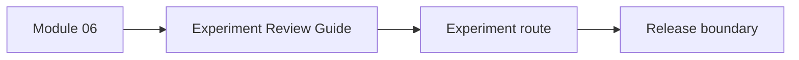
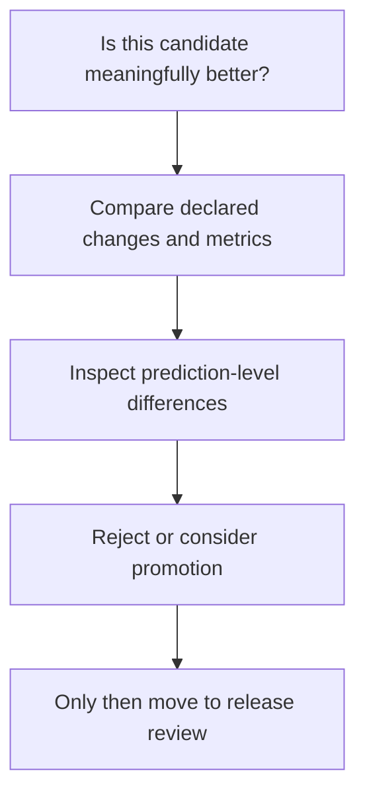

# Experiment Review Guide

<!-- page-maps:start -->
## Page Maps

<!-- page-maps:end -->

Use this guide when the course reaches Module 06 or when you need to review whether a
DVC experiment is disciplined rather than chaotic.

## Review rule

An experiment is only reviewable if you can say:

- what changed
- why the result is still comparable
- what metric movement matters
- what still needs release-boundary evidence before promotion

## Best companion pages

- [Evidence Boundary Guide](evidence-boundary-guide.md)
- [Verification Route Guide](verification-route-guide.md)
- [Capstone Map](capstone-map.md)
