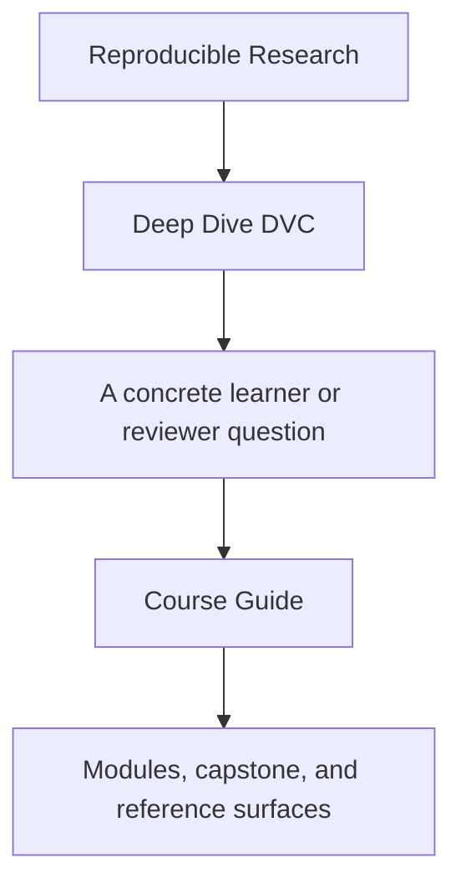
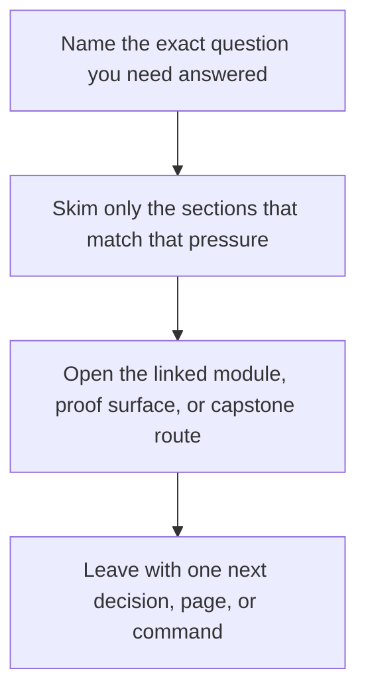

<a id="top"></a>

# Course Guide


<!-- page-maps:start -->
## Guide Fit




<!-- page-maps:end -->

Read the first diagram as a timing map: this guide is for a named pressure, not for wandering the whole course-book. Read the second diagram as the guide loop: arrive with a concrete question, use only the matching sections, then leave with one smaller and more honest next move.

Deep Dive DVC now has enough support pages that learners need one stable hub for finding
the right surface quickly. The goal is not to memorize DVC commands. The goal is to
learn how explicit state, truthful pipelines, and durable evidence fit together over a
ten-module sequence.

## Course Spine

The course has four linked layers:

1. entry pages and orientation
2. module work from state identity to promotion and governance
3. capstone proof in one executable repository
4. review surfaces for recovery, release, and stewardship questions

## The Four Arcs

### State foundations

Modules 01 to 03 establish the semantic floor:

- why reproducibility fails even when a pipeline can rerun once
- how data identity, cache truth, and execution environments become explicit state
- which layer of state answers which trust question

### Truthful execution and experiments

Modules 04 to 06 turn the state model into disciplined execution:

- pipelines become truthful DAGs instead of hopeful rerun stories
- metrics, parameters, and experiments gain explicit meaning and comparison rules
- experiments stop being chaos by acquiring bounded contracts

### Collaboration and recovery pressure

Modules 07 to 08 move the course from local correctness to survivability:

- CI, collaboration, and social contracts stop repository drift
- recovery, scale, and incident pressure expose whether the repository is still trustworthy

### Promotion and governance

Modules 09 to 10 finish the course where long-lived repositories are judged:

- release boundaries and auditability define what downstream users may trust
- migration and governance decisions stay tied to evidence instead of habit

## How The Capstone Fits

- Modules 01 to 03 explain the capstone's state surfaces, cache boundaries, and authority maps.
- Modules 04 to 06 explain its pipeline declarations, metrics, params, and experiment routes.
- Modules 07 to 08 explain its CI, recovery, and durability review surfaces.
- Modules 09 to 10 explain its publish contracts, audit routes, and stewardship rules.

## Support Pages To Keep Open

- [Module Promise Map](module-promise-map.md) when you want the module titles translated into explicit learner contracts
- [Module Checkpoints](module-checkpoints.md) when you need a module-end exit bar
- [Truth Contracts](truth-contracts.md) when you need to know what DVC will actually treat as change
- [Module Dependency Map](../reference/module-dependency-map.md) when the reading order needs justification
- [Authority Map](../reference/authority-map.md) when you need to know which state layer settles a question
- [Proof Ladder](proof-ladder.md) and [Proof Matrix](proof-matrix.md) when you need to size or route proof correctly
- [Capstone Map](../capstone/capstone-map.md) when you want the repository route by module

## Honest Expectation

If you rush, the course will feel administrative. If you read it in order and keep the
capstone in view, the later modules should feel like consequences of earlier state and
pipeline decisions rather than after-the-fact governance paperwork.

## Best Entry Commands

If you are learning:

```sh
make PROGRAM=reproducible-research/deep-dive-dvc capstone-tour
make PROGRAM=reproducible-research/deep-dive-dvc capstone-verify
```

If you are reviewing:

```sh
make PROGRAM=reproducible-research/deep-dive-dvc capstone-release-review
make PROGRAM=reproducible-research/deep-dive-dvc capstone-confirm
```

[Back to top](#top)
