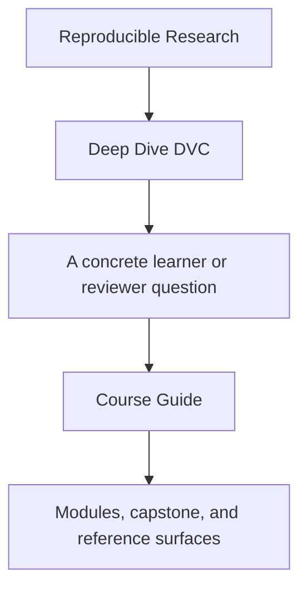
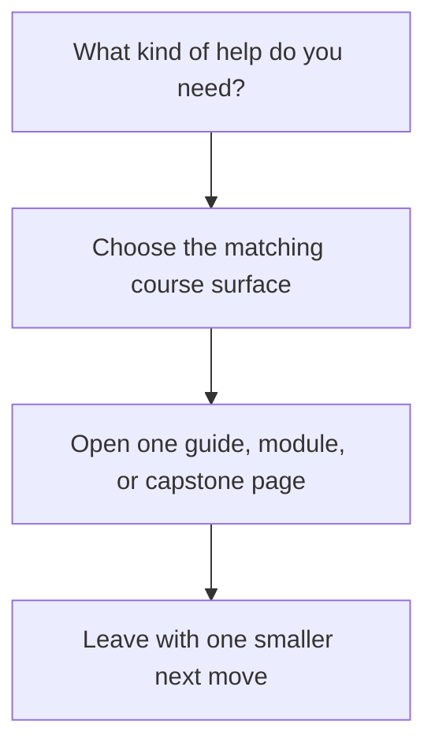

# Course Guide

<!-- page-maps:start -->
## Guide Fit

<!-- page-maps:end -->

Read the first diagram as a timing map: this guide is a support hub, not another chapter.
Read the second diagram as the loop: identify the kind of help you need, choose the
matching surface, then leave with one smaller next move.

Deep Dive DVC has four durable surfaces:

1. course home and orientation for entry and reading order
2. modules for the teaching arc itself
3. capstone pages for executable corroboration
4. reference pages for durable review and repair maps

## Choose the right surface

| If you need... | Start here | Do not start with |
| --- | --- | --- |
| first entry into the course | [Start Here](start-here.md) | the capstone repository |
| the module sequence explained | [Module 00](../module-00-orientation/index.md) | release or recovery pages |
| one support page for urgency | [Pressure Routes](pressure-routes.md) | random browsing through `guides/` |
| state authority and evidence rules | [Truth Contracts](truth-contracts.md) | the strongest available command |
| module-to-repository routing | [Capstone Map](../capstone/capstone-map.md) | raw repository files |
| durable review maps | [Reference](../reference/index.md) | course-home prose |

## The teaching arc

| Arc | Modules | What becomes legible |
| --- | --- | --- |
| state foundations | Modules 01-03 | data identity, cache truth, environment boundaries, and authority |
| truthful execution and experiments | Modules 04-06 | stage edges, params, metrics, and bounded experiment change |
| collaboration and recovery pressure | Modules 07-08 | CI discipline, survivability, and remote-backed restoration |
| promotion and governance | Modules 09-10 | downstream trust, migration boundaries, and stewardship judgment |

## The support shelf by job

- Read [Truth Contracts](truth-contracts.md) when change and evidence rules still feel fuzzy.
- Read [Module Promise Map](module-promise-map.md) when module titles feel too compressed.
- Read [Module Checkpoints](module-checkpoints.md) when you need a visible exit bar.
- Read [Pressure Routes](pressure-routes.md) when the reading order is shaped by urgency.
- Read [Proof Matrix](proof-matrix.md) when you already know the claim and need the evidence surface.
- Read [Command Guide](../capstone/command-guide.md) when you know the route but not the command layer.
- Read [Capstone Guide](../capstone/index.md) when you need the capstone contract before opening repository files.

## Best defaults

Use these as your stable defaults unless the current pressure gives you a stronger reason:

1. enter with [Start Here](start-here.md)
2. anchor in [Module 00](../module-00-orientation/index.md)
3. read modules in order
4. keep [Proof Ladder](proof-ladder.md) nearby
5. enter the capstone through [Capstone Map](../capstone/capstone-map.md)

## Good stopping point

Stop when you can answer two questions clearly:

- which surface should answer the next question
- why the heavier surfaces would be premature right now
