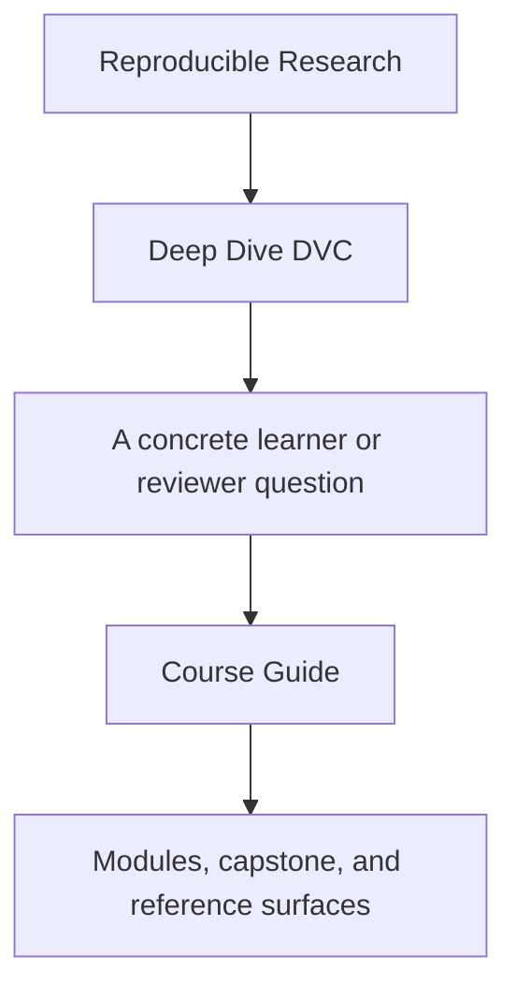
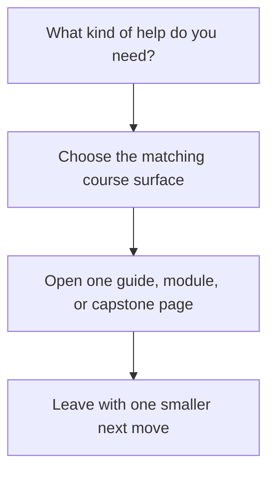

# Course Guide

<!-- page-maps:start -->
## Guide Fit

<!-- page-maps:end -->

Read the first diagram as a timing map: this guide is a support hub, not another chapter.
Read the second diagram as the loop: identify the kind of help you need, choose the
matching surface, then leave with one smaller next move.

Deep Dive DVC has four durable surfaces:

1. course home and orientation for entry and reading order
2. modules for the teaching arc itself
3. capstone pages for executable corroboration
4. reference pages for durable review and repair maps

## Choose the right surface

| If you need... | Start here | Do not start with |
| --- | --- | --- |
| first entry into the course | [Start Here](start-here.md) | the capstone repository |
| the module sequence explained | [Module 00](../module-00-orientation/index.md) | release or recovery pages |
| one support page for urgency | [Pressure Routes](pressure-routes.md) | random browsing through `guides/` |
| state authority and evidence rules | this page | [Review Checklist](../reference/review-checklist.md) |
| module-to-repository routing | [Capstone Map](../capstone/capstone-map.md) | raw repository files |
| durable review maps | [Reference](../reference/index.md) | course-home prose |

## The teaching arc

| Arc | Modules | What becomes legible |
| --- | --- | --- |
| state foundations | Modules 01-03 | data identity, cache truth, environment boundaries, and authority |
| truthful execution and experiments | Modules 04-06 | stage edges, params, metrics, and bounded experiment change |
| collaboration and recovery pressure | Modules 07-08 | CI discipline, survivability, and remote-backed restoration |
| promotion and governance | Modules 09-10 | downstream trust, migration boundaries, and stewardship judgment |

## The support shelf by job

- Stay on this page when change and evidence rules still feel fuzzy.
- Read [Module Promise Map](module-promise-map.md) when module titles feel too compressed.
- Read [Module Checkpoints](module-checkpoints.md) when you need a visible exit bar.
- Read [Pressure Routes](pressure-routes.md) when the reading order is shaped by urgency.
- Read [Proof Matrix](proof-matrix.md) when you already know the claim and need the evidence surface.
- Read [Command Guide](../capstone/command-guide.md) when you know the route but not the command layer.
- Read [Capstone Guide](../capstone/index.md) when you need the capstone contract before opening repository files.

## Best defaults

Use these as your stable defaults unless the current pressure gives you a stronger reason:

1. enter with [Start Here](start-here.md)
2. anchor in [Module 00](../module-00-orientation/index.md)
3. read modules in order
4. keep [Proof Ladder](proof-ladder.md) nearby
5. enter the capstone through [Capstone Map](../capstone/capstone-map.md)

## Good stopping point

Stop when you can answer two questions clearly:

- which surface should answer the next question
- why the heavier surfaces would be premature right now

## State Authority And Evidence Rules

Use this section when the main question is not "which DVC command exists?" but "what
exactly counts as truth here, and how would I prove it to another person?"

### Start with three questions

For every DVC repository question, answer these in order:

1. which layer is authoritative
2. what kind of change DVC will actually treat as meaningful
3. which file or command proves that claim

If you skip the first question, the later answers usually turn into folklore.

### Contract table

| Trust question | Authoritative layer | What counts as changed | Smallest honest proof route |
| --- | --- | --- | --- |
| did an input dataset change | the declared dependency in `dvc.yaml` plus the recorded hash in `dvc.lock` | the dependency content or declared target changed | inspect `dvc.yaml`, then compare `dvc.lock` or run `dvc status` |
| did a parameter change in a way the pipeline knows about | `params.yaml` plus the declared `params:` keys in `dvc.yaml` | only declared parameter keys affect stage change detection | inspect `params:` in `dvc.yaml`, then rerun or inspect `dvc.lock` |
| did a metric change in a reviewable way | the tracked metric file and the stage that produces it | the producing stage ran and wrote a new tracked metric artifact | inspect the metric file, then use `dvc metrics show` or the capstone verify route |
| can this experiment be compared honestly | the same declared deps, params, and outs contract as the baseline | only changes recorded through the declared comparison surface count | inspect declared params first, then use `dvc exp show` or the experiment-review bundle |
| can another person restore the tracked state after local loss | committed declarations plus the configured DVC remote | the remote still has the needed objects and the repository still declares them correctly | run the recovery drill and inspect the recovery review bundle |
| what may a downstream user trust | the promoted publish bundle and its manifest, not the whole repository | only promoted files and documented review meaning belong in the downstream contract | inspect `publish/v1/manifest.json` and the release review route |

### The most common misread

Changing a file does not automatically make it part of DVC's truth contract.

A parameter only becomes part of stage truth when it is declared under `params:` in
`dvc.yaml`. A metric only becomes a reviewable comparison surface when the repository
says what it means and where it comes from. A promoted file only becomes downstream
trustworthy when the bundle documents why it belongs there.

That is why "the file changed" and "the repository is explicitly tracking that change"
are not the same claim.

### Minimal honest review loop

1. Read the declaration surface first, usually `dvc.yaml`.
2. Read the recorded surface next, usually `dvc.lock`.
3. Run one proof command such as `dvc status`, `dvc metrics show`, `dvc exp show`, or a capstone review route.
4. State what the evidence proves and what it still does not prove.

### Good review questions

- if this file changes, where is that dependency declared
- if this parameter changes, will DVC notice, or are we assuming it will
- if the workspace disappears, which layer restores it
- which proof route would I hand to another maintainer instead of narrating from memory
