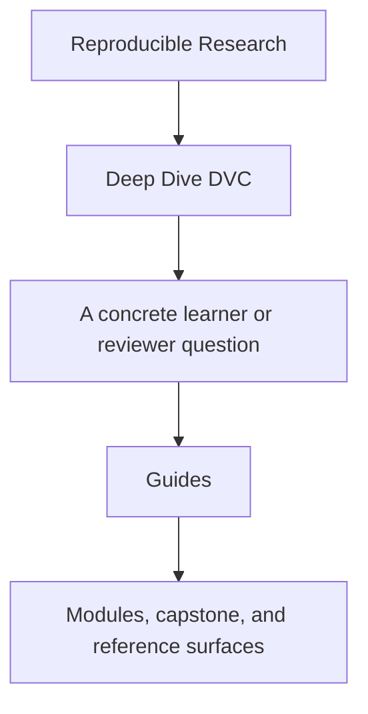
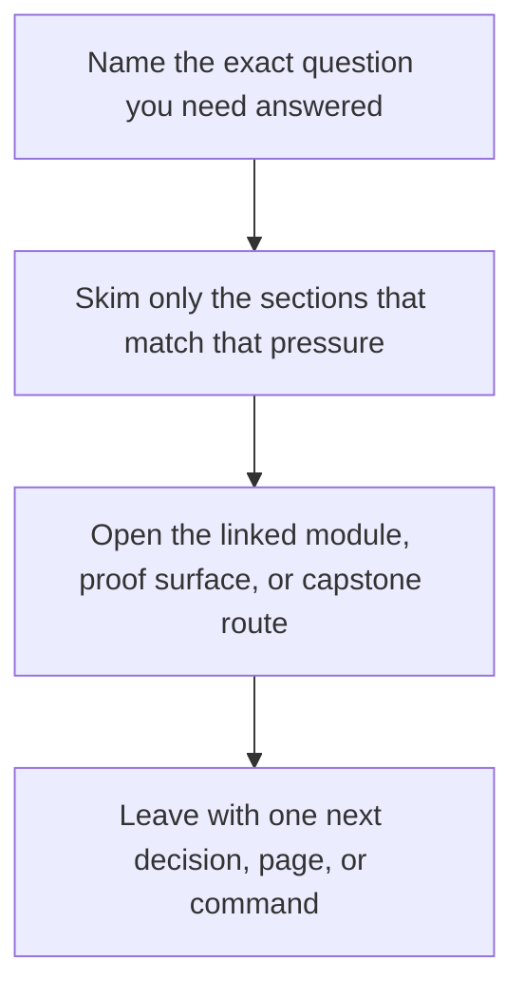

# Guides

<!-- page-maps:start -->
## Guide Fit

<!-- page-maps:end -->

Read the first diagram as a timing map: this guide is for a named pressure, not for wandering the whole course-book. Read the second diagram as the guide loop: arrive with a concrete question, use only the matching sections, then leave with one smaller and more honest next move.

The guides surface holds the learner routes for Deep Dive DVC. Use these pages when you
need study order, proof routing, or capstone reading help rather than a single module
chapter.

## Read These First

- [Start Here](start-here.md) for the shortest honest entry route
- [Course Guide](course-guide.md) for the full module arc and page roles
- [Learning Contract](learning-contract.md) for the teaching bar and proof expectations
- [Module 00: Orientation and Study Strategy](../module-00-orientation/index.md) for the course shape
- [Platform Setup](platform-setup.md) before you run local proof commands

## Use These For Study Planning

- [Pressure Routes](pressure-routes.md) when your route is shaped by recovery, stewardship, or repair pressure
- [Truth Contracts](truth-contracts.md) when you need change-detection and evidence rules in one place
- [Module Promise Map](module-promise-map.md) when you want each module title translated into a learner contract
- [Module Checkpoints](module-checkpoints.md) when you want a module-end exit bar before moving on
- [Module Dependency Map](../reference/module-dependency-map.md) when you need the safe reading order explained
- [Practice Map](../reference/practice-map.md) when you want the module-to-proof loop in one place

## Use These For Commands And Proof

- [Command Guide](command-guide.md) for command boundaries
- [Proof Ladder](proof-ladder.md) for choosing the smallest honest proof route
- [Proof Matrix](proof-matrix.md) for routing a claim to the right evidence surface
- [Authority Map](../reference/authority-map.md) when the question is which layer of state is authoritative
- [Evidence Boundary Guide](../reference/evidence-boundary-guide.md) when you need to separate declaration, execution, promotion, and recovery proof

## Use These For Capstone Reading

- [Capstone Guide](readme-capstone.md) for the repository contract
- [Capstone Architecture Guide](capstone-architecture-guide.md) for the repository structure
- [Capstone Map](capstone-map.md) for module-to-repository routing
- [Capstone File Guide](capstone-file-guide.md) for file responsibilities
- [Repository Layer Guide](repository-layer-guide.md) for authority and layer ownership
- [Experiment Review Guide](experiment-review-guide.md) for controlled deviation review
- [Release Review Guide](release-review-guide.md) for downstream trust review
- [Recovery Review Guide](recovery-review-guide.md) for durability review
- [Capstone Review Worksheet](capstone-review-worksheet.md) for structured repository assessment
- [Release Audit Checklist](release-audit-checklist.md) for promotion review
- [Capstone Extension Guide](capstone-extension-guide.md) for safe evolution

## Keep The Layout Stable

- `index.md` stays the course home
- `guides/` stays the learner route and proof shelf
- `reference/` stays the durable state and review shelf
- `module-00-orientation/` plus Modules `01` to `10` stay the teaching arc
