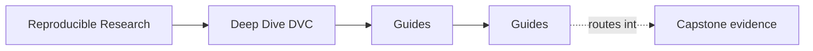
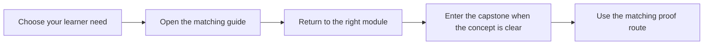

# Guides

<!-- page-maps:start -->
## Page Maps

<!-- page-maps:end -->

The guides surface holds the learner routes for Deep Dive DVC. Use these pages when you
need sequence, entry points, capstone reading order, or review checklists rather than a
single stable definition.

Use them in this order when you are new to the program:

1. [Start Here](start-here.md)
2. [Course Guide](course-guide.md)
3. [Learning Contract](learning-contract.md)
4. [Module 00: Orientation and Study Strategy](../module-00-orientation/index.md)
5. the ten module directories in order

## Start With These Pages

- [Start Here](start-here.md) if you need the right entry path
- [Course Guide](course-guide.md) if you want the fastest route to the right support page
- [Learning Contract](learning-contract.md) if you want the pedagogical boundaries first
- [Platform Setup](platform-setup.md) if you plan to run the proof surfaces locally

## Proof And Navigation Guides

- [Command Guide](command-guide.md) for command boundaries
- [Proof Matrix](proof-matrix.md) for claim-to-evidence routing
- [Capstone Map](capstone-map.md) for module-to-repository routing
- [Capstone File Guide](capstone-file-guide.md) for file responsibilities
- [Repository Layer Guide](repository-layer-guide.md) for layer ownership across the capstone

## Capstone Review Guides

- [Capstone Guide](readme-capstone.md) for the repository contract
- [Capstone Architecture Guide](capstone-architecture-guide.md) for the repository structure
- [Experiment Review Guide](experiment-review-guide.md) for controlled deviation review
- [Release Review Guide](release-review-guide.md) for downstream trust review
- [Recovery Review Guide](recovery-review-guide.md) for durability review
- [Capstone Review Worksheet](capstone-review-worksheet.md) for structured repository assessment
- [Release Audit Checklist](release-audit-checklist.md) for promotion review
- [Capstone Extension Guide](capstone-extension-guide.md) for safe evolution
