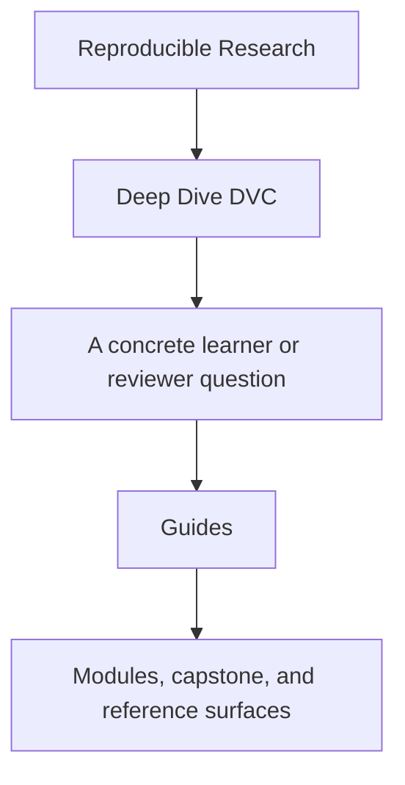
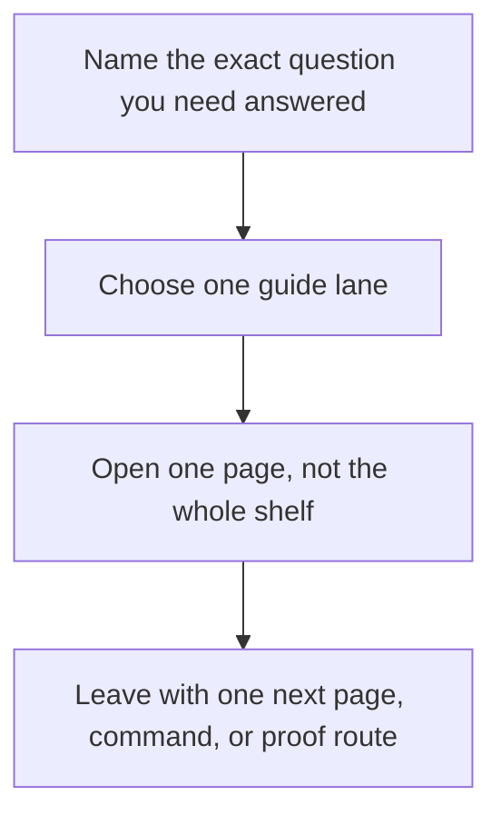

# Guides

<!-- page-maps:start -->
## Guide Fit

<!-- page-maps:end -->

Read the first diagram as a timing map: the guides shelf is for a named pressure, not
for wandering the whole course-book. Read the second diagram as the guide loop: choose
one lane, use one page, then leave with one smaller next move.

Use this shelf when you need route choice, proof sizing, or capstone entry help rather
than one module chapter.

## Choose one lane

| If you need... | Start here | Then use |
| --- | --- | --- |
| the shortest honest entry | [Start Here](start-here.md) | [Course Guide](course-guide.md) |
| the full support-page map | [Course Guide](course-guide.md) | [Learning Contract](learning-contract.md) |
| a route shaped by urgency | [Pressure Routes](pressure-routes.md) | [Proof Ladder](proof-ladder.md) |
| module promises and exit bars | [Module Promise Map](module-promise-map.md) | [Module Checkpoints](module-checkpoints.md) |
| state truth and evidence rules | [Truth Contracts](truth-contracts.md) | [Authority Map](../reference/authority-map.md) |
| capstone entry | [Capstone Guide](../capstone/index.md) | [Capstone Map](../capstone/capstone-map.md) |

## Study routes

- [Start Here](start-here.md) for the shortest stable route into the course
- [Course Guide](course-guide.md) for the role of each support surface
- [Learning Contract](learning-contract.md) for the teaching bar and proof expectations
- [Pressure Routes](pressure-routes.md) for repair, stewardship, and recovery entry paths
- [Platform Setup](platform-setup.md) before you run local proof commands

## Module support

- [Truth Contracts](truth-contracts.md) when you need change-detection and evidence rules in one place
- [Module Promise Map](module-promise-map.md) when you want each title translated into a learner contract
- [Module Checkpoints](module-checkpoints.md) when you need an exit bar before moving on
- [Module Dependency Map](../reference/module-dependency-map.md) when the reading order needs justification
- [Practice Map](../reference/practice-map.md) when you want the module-to-proof loop in one place

## Proof and command routes

- [Proof Ladder](proof-ladder.md) for choosing the smallest honest route
- [Proof Matrix](proof-matrix.md) for routing a claim to the right evidence surface
- [Authority Map](../reference/authority-map.md) when the question is which state layer is authoritative
- [Evidence Boundary Guide](../reference/evidence-boundary-guide.md) when you need to separate declaration, execution, promotion, and recovery proof
- [Command Guide](../capstone/command-guide.md) for command boundaries

## Capstone entry routes

- [Capstone Guide](../capstone/index.md) for the repository contract
- [Capstone Map](../capstone/capstone-map.md) for module and question routing
- [Capstone File Guide](../capstone/capstone-file-guide.md) for file responsibilities
- [Capstone Review Worksheet](../capstone/capstone-review-worksheet.md) for steward-level repository review
- [Release Audit Checklist](../capstone/release-audit-checklist.md) for downstream contract review
- [Capstone Extension Guide](../capstone/capstone-extension-guide.md) for safe evolution

## Good stopping point

Stop when you can name the single next page you need and the question it is supposed to
answer. If you are still opening whole shelves, go back to the table above and choose a
smaller lane.

## Shelf vocabulary

Use this section when the support shelf starts sounding more abstract than the course
intends. The goal is not to define DVC from scratch. The goal is to keep a small set of
course-level terms stable so you can move between guides, modules, and capstone routes
without changing what the words mean halfway through.

### Terms that matter on this shelf

| Term | Meaning here | Why it matters |
| --- | --- | --- |
| learner route | a short reading path for one concrete question | keeps you from opening five pages when one page would do |
| trust question | the exact reproducibility claim you are trying to settle | stops the course from turning into command memorization |
| authoritative layer | the file or state surface that should win when two surfaces disagree | keeps review tied to state ownership instead of habit |
| proof route | the smallest command, artifact, or file that can honestly test a claim | keeps evidence proportional to the question |
| publish boundary | the smaller downstream-facing bundle another person is allowed to trust | separates internal repository state from released state |
| recovery surface | the files and commands that prove local loss is survivable | keeps durability claims from becoming wishful thinking |
| capstone entry | the first bounded route into the executable repository | prevents the capstone from becoming first-contact reading |
| bounded review | an inspection pass with a clear stopping point | stops review from turning into aimless browsing |

### Guide names in plain language

| Page | What it is for |
| --- | --- |
| [Start Here](start-here.md) | safest first route into the program |
| [Course Guide](course-guide.md) | overview of when to use guides, modules, reference pages, or capstone routes |
| [Learning Contract](learning-contract.md) | the bar the course sets for explanation, proof, and honest progress |
| [Module Promise Map](module-promise-map.md) | translation of module titles into concrete learner outcomes |
| [Module Checkpoints](module-checkpoints.md) | readiness review before you move on |
| [Platform Setup](platform-setup.md) | tooling and setup checks before you trust local proof routes |
| [Pressure Routes](pressure-routes.md) | shortest honest route when urgency is shaping the reading order |
| [Proof Ladder](proof-ladder.md) | how to choose a smaller or larger proof route without guessing |
| [Proof Matrix](proof-matrix.md) | where a specific claim is first corroborated |
| [Truth Contracts](truth-contracts.md) | how to decide what counts as authoritative state and what actually proves it |

## Reading rule

If a guide name still feels vague after you read the tables above, do not open three
more guides. Name the job first, pick the one page that owns that job, and stop when you
have one clear next move.
