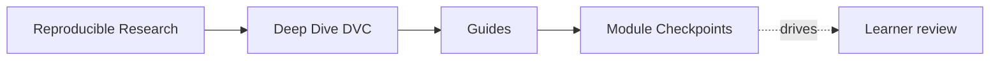
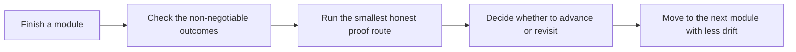

# Module Checkpoints

<!-- page-maps:start -->
## Page Maps

<!-- page-maps:end -->

This page is the missing study contract at the end of each module. It gives a human bar
for readiness instead of assuming that reading the prose once means the concept is
stable.

Use it when you are about to move on and want to know whether you are ready, what you are
still fuzzy on, and which proof route should settle the question.

---

## How To Use The Checkpoints

For each module:

1. read the module overview and main lessons
2. answer the checkpoint questions without looking at the text
3. run the smallest honest proof route
4. only advance when the concept feels explainable, not merely recognizable

[Back to top](#top)

---

## Checkpoint Table

| Module | You are ready when you can explain | You should be able to do | Useful proof route |
| --- | --- | --- | --- |
| 01 | why reruns and saved files are weaker than explicit state contracts | name the missing trust question in a weak reproducibility story | `capstone-tour` |
| 02 | why content identity is not the same thing as file location | distinguish workspace, cache, remote, and lockfile roles | `capstone-verify` |
| 03 | why environments belong in the state model | explain why the runtime boundary affects reproducibility truth | `capstone-verify` |
| 04 | how `dvc.yaml` and `dvc.lock` should tell one consistent story | review whether a pipeline edge is really declared | `capstone-repro` |
| 05 | what a metric or parameter comparison is allowed to mean | explain which controls must stay semantically stable | `capstone-verify` |
| 06 | how experiments can vary state without mutating the baseline contract | compare runs without muddying baseline truth | `capstone-experiment-review` |
| 07 | what another person should be able to rerun and review | explain which collaboration boundary protects trust | `capstone-confirm` |
| 08 | what survives cache loss and what only looked durable | describe the recovery story without hand-waving | `capstone-recovery-review` |
| 09 | what makes a promoted state surface small enough to trust | review whether downstream trust is smaller than repo complexity | `capstone-release-review` |
| 10 | when DVC should stop owning the problem | review a repository as a long-lived product with migration judgment | `capstone-confirm` |

[Back to top](#top)

---

## Failure Signals

Do not advance yet if any of these are still true:

* you recognize the term but cannot explain the trust question it settles
* you know the strongest proof command but not the smallest honest one
* you can follow the capstone mechanically but cannot name the authoritative layer
* you can repeat the repair pattern but cannot say what failure it prevents

These are not small study gaps. They are signals that the next module will feel more
administrative than it should.

[Back to top](#top)

---

## Best Companion Pages

Use these with the checkpoints:

* [`module-promise-map.md`](module-promise-map.md) to see what each title promised
* [`proof-ladder.md`](proof-ladder.md) to keep proof proportional to the question
* [`practice-map.md`](../reference/practice-map.md) to match module work with proof loops
* [`capstone-review-worksheet.md`](capstone-review-worksheet.md) when you want to record what the evidence actually showed

[Back to top](#top)
