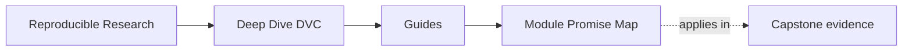
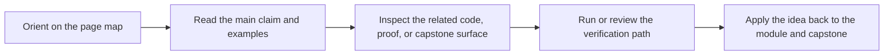

# Module Promise Map

<!-- page-maps:start -->
## Page Maps

<!-- page-maps:end -->

Use this page when a module title sounds right but still too compressed. A strong module
title should tell you what kind of judgment you will leave with, not just which tool or
topic bucket the chapter occupies.

## How to read this map

Each row answers four practical questions:

1. what the module is trying to change in your mental model
2. what boundary that promise is really about
3. what you should be able to do afterward
4. what capstone route first corroborates the lesson

If a module drifts away from that contract, the drift should be visible here.

## Module contracts

| Module | The promise | The boundary | You should leave able to... | First corroboration route |
| --- | --- | --- | --- | --- |
| [01 Reproducibility Failures](../module-01-reproducibility-failures-real-teams/index.md) | make weak reproducibility stories look obviously insufficient | failure modes, trust questions, state layers | explain why reruns and saved files are weaker than explicit state contracts | [Capstone Guide](../capstone/index.md) |
| [02 Data Identity](../module-02-data-identity-content-addressing/index.md) | teach durable state identity rather than path-based intuition | workspace, cache, remote, lockfile, content addressing | distinguish location from durable identity and say which layer is authoritative | [Command Guide](../capstone/command-guide.md) |
| [03 Environments and Execution Context](../module-03-execution-environments-reproducible-inputs/index.md) | make runtime context part of reproducibility truth instead of invisible setup | environment, code, validation, execution assumptions | explain why environment boundaries belong in the state model | [Capstone File Guide](../capstone/capstone-file-guide.md) |
| [04 Truthful Pipelines](../module-04-truthful-pipelines-declared-dependencies/index.md) | treat `dvc.yaml` and `dvc.lock` as one explicit execution contract | stages, deps, outs, params, recorded execution state | review whether a pipeline edge is truly declared | [Capstone File Guide](../capstone/capstone-file-guide.md) |
| [05 Metrics and Parameters](../module-05-metrics-parameters-comparable-meaning/index.md) | teach semantic comparability instead of metric folklore | params, metrics, reports, comparison boundaries | say what a metric comparison is allowed to mean and why | [Capstone Proof Guide](../capstone/capstone-proof-guide.md) |
| [06 Experiments](../module-06-experiments-baselines-controlled-change/index.md) | show how to vary the control surface without mutating baseline truth | experiment runs, baselines, declared controls, comparison routes | explain how changed runs stay comparable to the baseline | [Capstone Proof Guide](../capstone/capstone-proof-guide.md) |
| [07 Collaboration and CI](../module-07-collaboration-ci-social-contracts/index.md) | teach what another maintainer should be able to rerun and review | reviewability, CI gates, handoff trust, repo policy | explain what must stay legible without oral explanation | [Capstone Review Worksheet](../capstone/capstone-review-worksheet.md) |
| [08 Recovery and Scale](../module-08-recovery-scale-incident-survival/index.md) | make durability and restoration boundaries reviewable under pressure | cache loss, remote-backed restore, recovery evidence | explain what survives local loss and what only looked durable | [Capstone Proof Guide](../capstone/capstone-proof-guide.md) |
| [09 Promotion and Auditability](../module-09-promotion-registry-boundaries-auditability/index.md) | teach promotion as a smaller trusted boundary instead of a repository dump | publish surfaces, manifests, release review, promotion evidence | review what downstream users may trust from the promoted bundle | [Capstone Proof Guide](../capstone/capstone-proof-guide.md) |
| [10 Migration and Governance](../module-10-migration-governance-dvc-boundaries/index.md) | teach stewardship, migration order, and honest DVC limits | governance, anti-patterns, tool boundaries, migration review | decide whether DVC should keep owning the concern | [Capstone Review Worksheet](../capstone/capstone-review-worksheet.md) |

## What this page prevents

This map exists to prevent four common course failures:

- a module promises judgment but only delivers commands
- a module promises operations but never reaches executable proof
- a module promises promotion or recovery but leaves the review route blurry
- a module promises governance but never turns into review behavior

If you notice one of those failures while reading, come back here and name the missing
piece directly.

## Best companion pages

- [Module Checkpoints](module-checkpoints.md) when you need the exit bar after the promise
- [Proof Ladder](proof-ladder.md) when the corroboration route feels too heavy
- [Capstone Map](../capstone/capstone-map.md) when the promise is clear but the repository route is not
